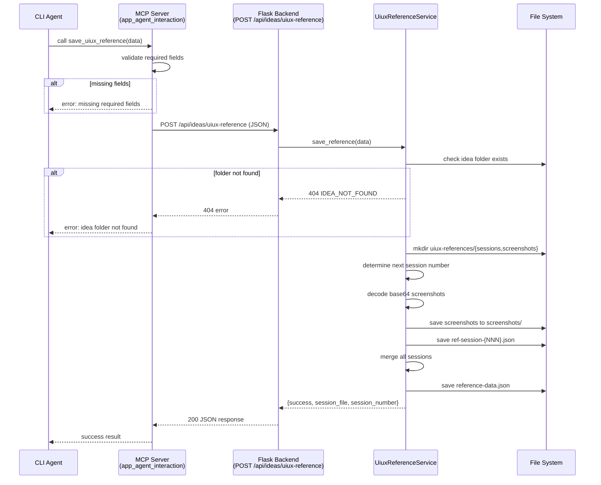
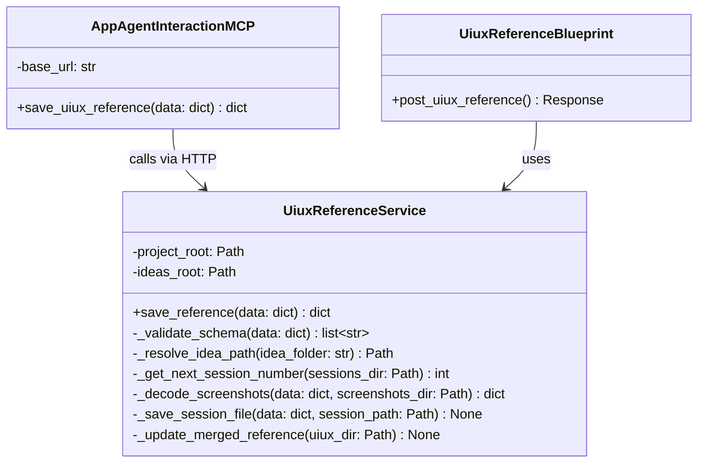

# Technical Design: App-Agent Interaction MCP

> Feature ID: FEATURE-033 | Version: v1.0 | Last Updated: 02-13-2026

---

## Part 1: Agent-Facing Summary

> **Purpose:** Quick reference for AI agents navigating large projects.
> **📌 AI Coders:** Focus on this section for implementation context.

### Key Components Implemented

| Component | Responsibility | Scope/Impact | Tags |
|-----------|----------------|--------------|------|
| `app_agent_interaction` MCP server | Standalone MCP server (FastMCP, stdio) exposing tools for app↔agent communication | New module: `src/x_ipe/mcp/app_agent_interaction.py` | #mcp #fastmcp #stdio #app-agent |
| `UiuxReferenceService` | Validates, decodes, and persists UIUX reference data to idea folders | New service: `src/x_ipe/services/uiux_reference_service.py` | #service #uiux #reference #persistence |
| `uiux_reference_routes` blueprint | Flask endpoint `POST /api/ideas/uiux-reference` | New blueprint: `src/x_ipe/routes/uiux_reference_routes.py` | #flask #api #endpoint #blueprint |
| MCP config entries | Config for all CLI adapters (Copilot, Claude Code, OpenCode) | Updated: `.github/copilot/mcp-config.json`, `src/x_ipe/resources/copilot/mcp-config.json` | #mcp #config #cli-adapter |

### Dependencies

| Dependency | Source | Design Link | Usage Description |
|------------|--------|-------------|-------------------|
| `IdeasService` | FEATURE-008 | — | Resolve idea folder paths, validate folder exists |
| `x_ipe_tracing` | Foundation | — | Decorate routes and service methods for observability |
| Flask app factory | Foundation | — | Register new blueprint in `_register_blueprints()` |
| MCPDeployerService | Foundation | — | Deploy MCP config to CLI adapters during `x-ipe init` |
| FastMCP (new dep) | External | [pypi](https://pypi.org/project/fastmcp/) | Python MCP server framework with `@mcp.tool` decorator |

### Major Flow

1. Agent calls MCP tool `save_uiux_reference` with reference data JSON → MCP server validates required fields → POSTs to Flask backend `POST /api/ideas/uiux-reference`
2. Flask endpoint receives JSON → `UiuxReferenceService` validates schema → resolves idea folder → auto-creates `uiux-references/` subdirectories → decodes base64 screenshots → saves session JSON → updates merged `reference-data.json` → returns success with session file path
3. MCP tool returns Flask response to agent

### Usage Example

```python
# Agent calls MCP tool (handled by FastMCP framework)
# Tool name: save_uiux_reference
# Input: reference data JSON

# Example MCP tool call payload:
{
  "version": "1.0",
  "source_url": "https://example.com/landing",
  "timestamp": "2026-02-13T09:00:00Z",
  "idea_folder": "018. Feature-UIUX Reference",
  "colors": [
    {"id": "color-001", "hex": "#1A73E8", "rgb": "26, 115, 232", "hsl": "217, 80%, 51%", "source_selector": "header .logo", "context": "Brand primary"}
  ],
  "elements": [],
  "design_tokens": {"colors": {"primary": "#1A73E8"}, "typography": {"heading_font": "Google Sans"}}
}

# Response from MCP tool:
# {"success": True, "session_file": "ref-session-001.json", "session_number": 1}
```

```python
# Flask endpoint usage (internal):
from x_ipe.services import UiuxReferenceService

service = UiuxReferenceService(project_root)
result = service.save_reference(data)
# result: {"success": True, "session_file": "ref-session-001.json", "session_number": 1, "screenshots_saved": 0}
```

---

## Part 2: Implementation Guide

> **Purpose:** Human-readable details for developers.
> **📌 Emphasis on visual diagrams for comprehension.

### Workflow Diagram



### Class Diagram



### Data Models

#### Reference Data JSON Schema (Input)

```python
# Required fields
REQUIRED_FIELDS = ["version", "source_url", "timestamp", "idea_folder"]

# At least one data section must be non-empty
DATA_SECTIONS = ["colors", "elements", "design_tokens"]

# Full schema (validated by UiuxReferenceService)
{
    "version": str,           # "1.0"
    "source_url": str,        # target URL
    "auth_url": str | None,   # optional auth prerequisite URL
    "timestamp": str,         # ISO 8601
    "idea_folder": str,       # folder name under x-ipe-docs/ideas/
    "colors": [               # optional
        {
            "id": str,
            "hex": str,
            "rgb": str | None,
            "hsl": str | None,
            "source_selector": str | None,
            "context": str | None
        }
    ],
    "elements": [             # optional
        {
            "id": str,
            "selector": str,
            "tag": str | None,
            "bounding_box": {"x": int, "y": int, "width": int, "height": int} | None,
            "screenshots": {
                "full_page": str | None,   # file path or "base64:..." encoded
                "element_crop": str | None  # file path or "base64:..." encoded
            } | None,
            "comment": str | None,
            "extracted_assets": dict | None
        }
    ],
    "design_tokens": {        # optional
        "colors": dict | None,
        "typography": dict | None
    }
}
```

#### Success Response

```json
{
    "success": true,
    "session_file": "ref-session-001.json",
    "session_number": 1,
    "screenshots_saved": 2,
    "merged_reference_updated": true
}
```

#### Error Response

```json
{
    "success": false,
    "error": "VALIDATION_ERROR",
    "message": "Missing required field: idea_folder",
    "details": {"missing_fields": ["idea_folder"]}
}
```

### API Specification

#### POST /api/ideas/uiux-reference

**Request:**
```json
{
    "version": "1.0",
    "source_url": "https://example.com",
    "timestamp": "2026-02-13T09:00:00Z",
    "idea_folder": "018. Feature-UIUX Reference",
    "colors": [...],
    "elements": [...],
    "design_tokens": {...}
}
```

**Response (200):**
```json
{
    "success": true,
    "session_file": "ref-session-001.json",
    "session_number": 1,
    "screenshots_saved": 0,
    "merged_reference_updated": true
}
```

**Errors:**

| Status | Error Code | Description |
|--------|-----------|-------------|
| 400 | VALIDATION_ERROR | Missing required fields or empty data sections |
| 404 | IDEA_NOT_FOUND | `idea_folder` does not match an existing folder |
| 413 | PAYLOAD_TOO_LARGE | Request body exceeds 10MB |
| 500 | WRITE_ERROR | File system error during save |

### File Structure (Output)

```
x-ipe-docs/ideas/{idea_folder}/
└── uiux-references/                    # auto-created
    ├── reference-data.json             # merged view of all sessions
    ├── sessions/                       # auto-created
    │   ├── ref-session-001.json        # individual session
    │   └── ref-session-002.json
    └── screenshots/                    # auto-created
        ├── full-page-001.png
        └── elem-001-crop.png
```

### Implementation Steps

#### 1. Add FastMCP Dependency

**File:** `pyproject.toml`

Add `fastmcp>=2.0.0` to `dependencies` list. Run `uv sync`.

#### 2. Create MCP Server Module

**File:** `src/x_ipe/mcp/__init__.py` (empty)
**File:** `src/x_ipe/mcp/app_agent_interaction.py`

```python
from fastmcp import FastMCP
import requests
import os

mcp = FastMCP(name="x-ipe-app-and-agent-interaction")

BASE_URL = os.environ.get("X_IPE_BASE_URL", "http://localhost:5000")

@mcp.tool
def save_uiux_reference(data: dict) -> dict:
    """Save UIUX reference data (colors, elements, screenshots, design tokens)
    to an idea folder. The data is validated and persisted by the X-IPE backend.

    Args:
        data: Reference data JSON with required fields: version, source_url,
              timestamp, idea_folder. Must include at least one of: colors,
              elements, design_tokens.
    """
    # Validate required fields locally before HTTP call
    missing = [f for f in ["version", "source_url", "timestamp", "idea_folder"]
               if f not in data or not data[f]]
    if missing:
        return {"success": False, "error": "VALIDATION_ERROR",
                "message": f"Missing required fields: {', '.join(missing)}"}

    try:
        resp = requests.post(f"{BASE_URL}/api/ideas/uiux-reference",
                           json=data, timeout=30)
        return resp.json()
    except requests.ConnectionError:
        return {"success": False, "error": "BACKEND_UNREACHABLE",
                "message": f"Cannot connect to X-IPE backend at {BASE_URL}"}
    except requests.Timeout:
        return {"success": False, "error": "BACKEND_TIMEOUT",
                "message": "Request to X-IPE backend timed out (30s)"}

if __name__ == "__main__":
    mcp.run()
```

**Key decisions:**
- Single file — KISS, server has one tool in Phase 1
- `requests` for HTTP (already a project dependency)
- `BASE_URL` from environment variable, default `http://localhost:5000`
- Local validation before HTTP to fail fast
- `mcp.run()` uses stdio transport by default

#### 3. Create UiuxReferenceService

**File:** `src/x_ipe/services/uiux_reference_service.py`

Core logic in a service class following existing patterns:

```python
class UiuxReferenceService:
    IDEAS_PATH = 'x-ipe-docs/ideas'
    REQUIRED_FIELDS = ["version", "source_url", "timestamp", "idea_folder"]
    DATA_SECTIONS = ["colors", "elements", "design_tokens"]

    def __init__(self, project_root: str):
        self.project_root = Path(project_root).resolve()
        self.ideas_root = self.project_root / self.IDEAS_PATH
```

**Methods:**

| Method | Input | Output | Description |
|--------|-------|--------|-------------|
| `save_reference(data)` | dict | dict | Main entry point — orchestrates validation, save, merge |
| `_validate_schema(data)` | dict | list[str] | Returns list of validation error messages |
| `_resolve_idea_path(folder)` | str | Path | Resolves and validates idea folder path |
| `_get_next_session_number(dir)` | Path | int | Scans existing sessions, returns max+1 |
| `_decode_screenshots(data, dir)` | dict, Path | dict | Finds `base64:` prefixed values, decodes to files, replaces with paths |
| `_save_session_file(data, path)` | dict, Path | None | Atomic write (tmp + rename) |
| `_update_merged_reference(dir)` | Path | None | Read all sessions, merge, atomic write |

**Atomic write pattern:**
```python
import tempfile, json, os

def _save_session_file(self, data: dict, session_path: Path) -> None:
    tmp_fd, tmp_path = tempfile.mkstemp(dir=session_path.parent, suffix='.tmp')
    try:
        with os.fdopen(tmp_fd, 'w') as f:
            json.dump(data, f, indent=2)
        os.rename(tmp_path, session_path)
    except Exception:
        os.unlink(tmp_path)
        raise
```

**Merge logic for `reference-data.json`:**
- Read all `ref-session-*.json` files, sorted by number
- Merge `colors` arrays — deduplicate by `id`, keep latest
- Merge `elements` arrays — deduplicate by `id`, keep latest
- Use latest session's `design_tokens`
- Record list of `source_urls` from all sessions
- Set `last_updated` to current timestamp

#### 4. Create Flask Blueprint

**File:** `src/x_ipe/routes/uiux_reference_routes.py`

```python
from flask import Blueprint, jsonify, request, current_app
from x_ipe.services import UiuxReferenceService
from x_ipe.tracing import x_ipe_tracing

uiux_reference_bp = Blueprint('uiux_reference', __name__)

@uiux_reference_bp.route('/api/ideas/uiux-reference', methods=['POST'])
@x_ipe_tracing()
def post_uiux_reference():
    project_root = current_app.config.get('PROJECT_ROOT', os.getcwd())
    service = UiuxReferenceService(project_root)

    data = request.json
    if not data:
        return jsonify({"success": False, "error": "VALIDATION_ERROR",
                        "message": "Request body must be JSON"}), 400

    result = service.save_reference(data)

    if not result.get("success"):
        status = 404 if result.get("error") == "IDEA_NOT_FOUND" else 400
        return jsonify(result), status

    return jsonify(result), 200
```

#### 5. Register Blueprint

**File:** `src/x_ipe/app.py` — add to `_register_blueprints()`:

```python
from x_ipe.routes.uiux_reference_routes import uiux_reference_bp
app.register_blueprint(uiux_reference_bp)
```

#### 6. Export Service

**File:** `src/x_ipe/services/__init__.py` — add:

```python
from .uiux_reference_service import UiuxReferenceService
# Add to __all__
```

#### 7. MCP Config (Already Done)

Both `.github/copilot/mcp-config.json` and `src/x_ipe/resources/copilot/mcp-config.json` already updated with `x-ipe-app-and-agent-interaction` entry. MCPDeployerService handles format conversion for all CLI adapters automatically.

### Edge Cases & Error Handling

| Scenario | Component | Expected Behavior |
|----------|-----------|-------------------|
| Idea folder not found | Service | Return `{"error": "IDEA_NOT_FOUND", "message": "Idea folder not found: {name}"}` |
| All data sections empty | Service | Return `{"error": "VALIDATION_ERROR", "message": "At least one data section required"}` |
| Base64 screenshot decode fails | Service | Log warning, skip that screenshot, continue saving rest |
| Session folder has gaps (001, 003) | Service | Next session = max(existing) + 1 = 004 |
| Concurrent saves to same idea | Service | Atomic writes prevent corruption; second writer gets next number |
| Flask backend unreachable | MCP server | Return `{"error": "BACKEND_UNREACHABLE", "message": "..."}` |
| Request body > 10MB | Flask | Return 413 via Flask `MAX_CONTENT_LENGTH` config |
| Special chars in idea folder name | Service | Use `Path` resolution; no URL encoding needed (local FS only) |

### Testing Strategy

| Test Category | Scope | Key Tests |
|---------------|-------|-----------|
| Unit: UiuxReferenceService | Service | Schema validation, session numbering, screenshot decoding, merge logic, atomic writes, error cases |
| Unit: Flask endpoint | Route | Valid request → 200, invalid schema → 400, missing folder → 404, empty body → 400 |
| Unit: MCP tool | MCP server | Valid call → success, missing fields → local validation error, backend unreachable → error |
| Integration | End-to-end | MCP tool → Flask endpoint → file system → verify files on disk |

---

## Design Change Log

| Date | Phase | Change Summary |
|------|-------|----------------|
| 02-13-2026 | Initial Design | Initial technical design: FastMCP server (`x_ipe.mcp.app_agent_interaction`), `UiuxReferenceService`, Flask blueprint, MCP config for all CLI adapters. |
