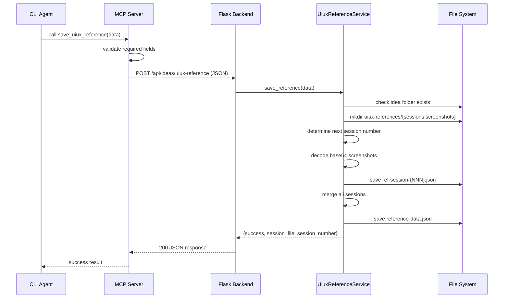

# Technical Design: App-Agent Interaction MCP

> Feature ID: FEATURE-033 | Version: v1.0 | Last Updated: 02-13-2026

---

## Part 1: Agent-Facing Summary

### Key Components Implemented

| Component | Responsibility | Scope/Impact | Tags |
|-----------|----------------|--------------|------|
| `app_agent_interaction` MCP server | Standalone MCP server (FastMCP, stdio) exposing tools for app↔agent communication | Module: `src/x_ipe/mcp/app_agent_interaction.py` | #mcp #fastmcp #stdio |
| `UiuxReferenceService` | Validates, decodes, and persists UIUX reference data to idea folders | Service: `src/x_ipe/services/uiux_reference_service.py` | #service #uiux #persistence |
| `uiux_reference_routes` blueprint | Flask endpoint `POST /api/ideas/uiux-reference` | Blueprint: `src/x_ipe/routes/uiux_reference_routes.py` | #flask #api #endpoint |
| MCP config entries | Config for all CLI adapters (Copilot, Claude Code, OpenCode) | Config: `.github/copilot/mcp-config.json` | #mcp #config |

### Dependencies

| Dependency | Source | Usage Description |
|------------|--------|-------------------|
| `IdeasService` | FEATURE-008 | Resolve idea folder paths |
| `x_ipe_tracing` | Foundation | Decorate routes for observability |
| Flask app factory | Foundation | Register new blueprint |
| MCPDeployerService | Foundation | Deploy MCP config to CLI adapters |
| FastMCP (dep) | External | Python MCP server framework |

### Major Flow

1. **save_uiux_reference:** Agent calls MCP tool → MCP server validates required fields → POSTs to Flask backend
2. Flask endpoint receives JSON → `UiuxReferenceService` validates → resolves folder → saves session → updates merged reference → returns success
3. MCP tool returns Flask response to agent

### Usage Example

```python
# MCP tool call payload:
{
  "version": "1.0",
  "source_url": "https://example.com/landing",
  "timestamp": "2026-02-13T09:00:00Z",
  "idea_folder": "018. Feature-UIUX Reference",
  "colors": [
    {"id": "color-001", "hex": "#1A73E8", "rgb": "26, 115, 232"}
  ],
  "elements": [],
  "design_tokens": {"colors": {"primary": "#1A73E8"}}
}

# Response: {"success": True, "session_file": "ref-session-001.json", "session_number": 1}
```

---

## Part 2: Implementation Guide

### Workflow Diagram



### Class Diagram


### File Structure (Output)

```
x-ipe-docs/ideas/{idea_folder}/
└── uiux-references/
    ├── reference-data.json
    ├── sessions/
    │   ├── ref-session-001.json
    │   └── ref-session-002.json
    └── screenshots/
        ├── full-page-001.png
        └── elem-001-crop.png
```

### Testing Strategy

| Test Category | Scope | Key Tests |
|---------------|-------|-----------|
| Unit: UiuxReferenceService | Service | Schema validation, session numbering, screenshot decoding, merge logic |
| Unit: Flask endpoint | Route | Valid request → 200, invalid → 400, missing folder → 404 |
| Unit: MCP tool | MCP server | Valid call → success, missing fields → error, backend unreachable → error |
| Integration | End-to-end | MCP tool → Flask → file system → verify files |
