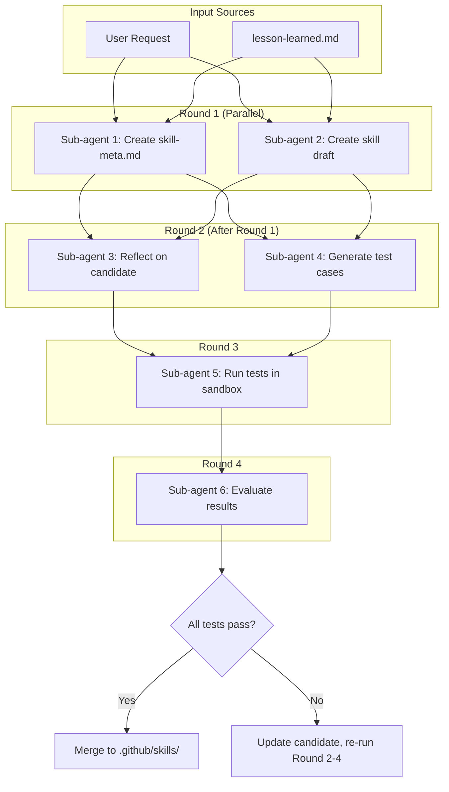

# Sub-Agent DAG Workflow Reference

> Detailed procedures for each sub-agent in the Skill Creator workflow.

## Workflow Diagram



---

## Create vs Update Workflow

### Create Workflow

Use when: Creating a new skill from scratch.

| Sub-Agent | Input | Action |
|-----------|-------|--------|
| 1 | User request | Create new skill-meta.md using template |
| 2 | User request | Create new candidate/ with full skill structure |

### Update Workflow

Use when: Updating existing skill based on lessons or user request.

| Sub-Agent | Input | Action |
|-----------|-------|--------|
| 1 | User request OR lesson-learned.md | Analyze gaps, update acceptance_criteria |
| 2 | User request OR lesson-learned.md | Update candidate/ based on changes |

**Update workflow pre-step:**
```
1. Check if x-ipe-docs/skill-meta/{skill-name}/lesson-learned.md exists
2. If exists with status: raw lessons:
   - Read lessons
   - Include in Sub-agent 1 and 2 prompts
   - After successful update, change lesson status to: incorporated
3. If no lessons, use user request directly
```

---

## Sub-Agent Procedures

### Model Selection Guidelines

```yaml
model_selection:
  haiku:
    use_for:
      - Template-filling and structured extraction
      - Test case generation (structured format)
      - Test execution (procedural tasks)
    cost: Lower
    
  sonnet:
    use_for:
      - Complex reasoning and analysis
      - Content creation requiring judgment
      - Quality evaluation with rubrics
    cost: Higher
```

### Sub-Agent 1: Create Skill Meta

**Model:** haiku (template-filling is straightforward)

**Prompt Template:**
```
You are creating a skill-meta.md specification for a {skill_type} skill.

Input:
- Skill name: {skill_name}
- User request: {user_request}
- Lessons (if update): {lessons_summary}

Template: x-ipe-docs/skill-meta/templates/skill-meta-{skill_type}.md

Instructions:
1. Read the skill-meta template for {skill_type}
2. Create skill-meta.md with:
   - All YAML frontmatter fields populated
   - Acceptance criteria following MoSCoW priority
   - At least 3 MUST criteria, 2 SHOULD criteria
   - Test scenarios for each MUST criterion
3. If updating: incorporate lessons as new acceptance criteria
4. Save to: x-ipe-docs/skill-meta/{skill_name}/skill-meta.md

Output:
- skill-meta.md created/updated
- Summary of acceptance criteria defined
```

### Sub-Agent 2: Create Skill Draft

**Model:** sonnet (skill content requires complex reasoning)

**Prompt Template:**
```
You are creating a candidate skill draft for {skill_name}.

Input:
- Skill name: {skill_name}
- Skill type: {skill_type}
- User request: {user_request}
- Lessons (if update): {lessons_summary}

Skill Template: .github/skills/x-ipe-skill-creator/templates/{skill_type}-skill.md

Instructions:
1. Create directory: x-ipe-docs/skill-meta/{skill_name}/candidate/
2. Read the skill template for {skill_type}
3. Create full skill structure:
   - SKILL.md (following template sections exactly)
   - references/ (if needed)
   - templates/ (if needed)
   - scripts/ (if needed)
4. If updating: copy current skill to candidate, apply changes
5. Follow all skill creator core principles

Output:
- candidate/ folder with complete skill structure
- List of files created
```

### Sub-Agent 3: Reflect and Improve

**Model:** sonnet (reflection requires deep analysis)

**Prompt Template:**
```
You are reviewing a candidate skill against its specification.

Input:
- Skill meta: x-ipe-docs/skill-meta/{skill_name}/skill-meta.md
- Candidate: x-ipe-docs/skill-meta/{skill_name}/candidate/

Instructions:
1. Read skill-meta.md acceptance criteria
2. Read candidate/SKILL.md and all bundled resources
3. For each acceptance criterion, verify:
   - Is this criterion addressed in the skill?
   - Is the implementation correct?
4. Identify gaps:
   - Missing sections
   - Incomplete implementations
   - Misaligned with criteria
5. Fix identified issues in candidate/
6. Document changes made

Output:
- Updated candidate/ files
- Reflection report: gaps found, fixes applied
```

### Sub-Agent 4: Generate Test Cases

**Model:** haiku (test case generation is structured extraction)

**Prompt Template:**
```
You are generating test cases from skill-meta acceptance criteria.

Input:
- Skill meta: x-ipe-docs/skill-meta/{skill_name}/skill-meta.md

Template: x-ipe-docs/skill-meta/templates/test-cases.md

Instructions:
1. Read skill-meta.md acceptance_criteria section
2. For each criterion:
   - Create test case with unique TC-ID
   - Link to source AC-ID
   - Define setup, execution, validation
   - Assign evaluator (self_check or judge_agent)
3. Create timestamp folder: test-{YYYYMMDD-HHMMSS}/
4. Save test-cases.yaml

Test case priority:
- MUST criteria: All must have tests
- SHOULD criteria: All should have tests  
- COULD criteria: Optional tests

Output:
- test-{timestamp}/test-cases.yaml created
- Test case summary: X tests for Y acceptance criteria
```

### Sub-Agent 5: Run Tests

**Model:** haiku (test execution is procedural)

**Prompt Template:**
```
You are executing tests for a candidate skill.

Input:
- Candidate: x-ipe-docs/skill-meta/{skill_name}/candidate/
- Test cases: x-ipe-docs/skill-meta/{skill_name}/test-{timestamp}/test-cases.yaml

Instructions:
1. Create sandbox folder: test-{timestamp}/sandbox/
2. For each test case:
   a. Set up test environment (create input artifacts)
   b. Load candidate skill
   c. Execute skill with test inputs
   d. Save outputs to sandbox/
   e. Record execution success/failure
3. Do NOT evaluate results (Sub-agent 6 does that)
4. Log all execution details

Output:
- sandbox/ folder with skill outputs
- execution-log.yaml with run details
```

### Sub-Agent 6: Evaluate Results

**Model:** sonnet (quality evaluation requires judgment)

**Prompt Template:**
```
You are evaluating test results for a candidate skill.

Input:
- Test cases: x-ipe-docs/skill-meta/{skill_name}/test-{timestamp}/test-cases.yaml
- Sandbox: x-ipe-docs/skill-meta/{skill_name}/test-{timestamp}/sandbox/
- Execution log: sandbox/execution-log.yaml

Instructions:
1. For each test case:
   a. Apply validation checks from test case
   b. If evaluator = self_check:
      - Run structural/content validation
      - Score: pass/fail
   c. If evaluator = judge_agent:
      - Apply rubric scoring (1-5 scale)
      - Score: pass if weighted avg >= threshold
2. Calculate pass rates by priority:
   - MUST: X of Y passed (need 100%)
   - SHOULD: X of Y passed (need 80%)
   - COULD: X of Y passed (optional)
3. Generate evaluation report

Output:
- evaluation-report.yaml:
  - overall_pass: true/false
  - must_pass_rate: X%
  - should_pass_rate: X%
  - failed_tests: [list with reasons]
  - improvement_suggestions: [if failed]
```

---

## Decision Logic

After Sub-Agent 6 completes:

```python
if evaluation.overall_pass:
    # All MUST passed, >=80% SHOULD passed
    action = "MERGE"
    # 1. Copy candidate/ to .github/skills/{skill_name}/
    # 2. Update skill-version-history.md
    # 3. Mark lessons as incorporated (if any)
    # 4. Validate cross-references
else:
    # Tests failed
    if iteration_count < 3:
        action = "ITERATE"
        # 1. Analyze failed tests
        # 2. Update candidate based on failures
        # 3. Re-run from Round 2 (Sub-agents 3,4,5,6)
    else:
        action = "ESCALATE"
        # 1. Report failures to human
        # 2. Request guidance on how to proceed
```

---

## Iteration on Failure

When tests fail, the iteration loop:

1. **Analyze failures** - What went wrong?
2. **Categorize** - Is it skill issue or test issue?
3. **Fix** - Update candidate/ OR update test-cases.yaml
4. **Re-run** - From Sub-agent 3 (reflect) forward

Maximum 3 iterations before escalating to human.

---

## Parallel Execution Notes

Sub-agents in the same round can run in parallel:

| Round | Parallel Agents | Model | Dependencies |
|-------|-----------------|-------|--------------|
| 1 | SA1, SA2 | haiku, sonnet | None |
| 2 | SA3, SA4 | sonnet, haiku | SA1 complete, SA2 complete |
| 3 | SA5 | haiku | SA3 complete, SA4 complete |
| 4 | SA6 | sonnet | SA5 complete |

**Model Selection Rationale:**
- haiku: Simple, procedural tasks (template filling, test generation, test execution)
- sonnet: Complex reasoning tasks (skill creation, reflection, quality evaluation)

**Implementation note:** Use task tool with agent_type="general-purpose" for each sub-agent. Launch Round 1 agents in parallel, wait for both, then Round 2, etc.
