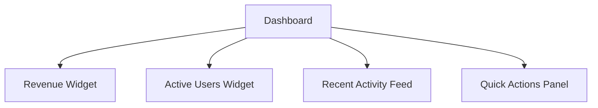

# Ideation - Examples

> Reference from SKILL.md: `See [references/examples.md](references/examples.md)`

---

## Example 1: Business Plan Ideation with Tools Enabled

**Scenario:** User uploads business plan draft to `x-ipe-docs/ideas/mobile-app-idea/files/`

**Config File:** `x-ipe-docs/config/tools.json`
```json
{
  "version": "2.0",
  "stages": {
    "ideation": {
      "ideation": {
        "antv-infographic": true,
        "mermaid": true
      },
      "mockup": {
        "frontend-design": true
      },
      "sharing": {}
    }
  }
}
```

**Execution:**
```
1. Execute Task Flow from x-ipe-workflow-task-execution skill

2. Load Toolbox Meta:
   - Read x-ipe-docs/config/tools.json
   - Enabled tools:
     - stages.ideation.ideation.antv-infographic: true → will invoke infographic-syntax-creator
     - stages.ideation.ideation.mermaid: true → will use mermaid diagrams
     - stages.ideation.mockup.frontend-design: true → will invoke frontend-design skill

3. Analyze Files:
   - Read business-plan.md
   - Read user-research.txt
   - Read competitor-notes.md

4. Initialize Tools:
   - infographic-syntax-creator skill → Available
   - mermaid capability → Available  
   - frontend-design skill → Available
   - Status: All enabled tools ready

5. Generate Summary:
   "I understand you want to build a mobile app for..."
   "Enabled tools: antv-infographic, mermaid (visualization), frontend-design (mockups)"
   
6. Brainstorming Questions (with Config-Driven Tool Usage):
   - "Your notes mention both iOS and Android - should v1 target both?"
   - "The user research shows two distinct personas - which is primary?"
   - User describes dashboard flow:
     → config.stages.ideation.ideation.mermaid == true
     → Generate mermaid flowchart to visualize
   - User wants to see dashboard layout:
     → config.stages.ideation.mockup.frontend-design == true  
     → Invoke frontend-design skill
     → Create HTML mockup, save to x-ipe-docs/ideas/mobile-app-idea/mockups/mockup-v1.html
   - Share mockup: "Does this layout match your vision?"
   - Iterate based on feedback

7. Research Common Principles (if applicable):
   - Mobile app → Research: Mobile UX best practices, offline-first patterns
   - User auth → Research: OAuth 2.0, biometric auth standards
   - Document sources for references section

8. Create x-ipe-docs/ideas/mobile-app-idea/idea-summary-v1.md with:
   - Overview and problem statement (text)
   - Key Features (config.stages.ideation.ideation.antv-infographic == true → use infographic: list-grid-badge-card)
   - User Flow (config.stages.ideation.ideation.mermaid == true → use mermaid flowchart)
   - Implementation Phases (infographic: sequence-roadmap-vertical-simple)
   - Platform Comparison (infographic: compare-binary-horizontal-badge-card-arrow)
   - Ideation Artifacts section with link to mockups created
   - References & Common Principles section with researched sources

9. Resume Task Flow from x-ipe-workflow-task-execution skill
```

---

## Example 2: Ideation WITHOUT Tools (All Disabled)

**Config File:** `x-ipe-docs/config/tools.json`
```json
{
  "version": "2.0",
  "stages": {
    "ideation": {
      "ideation": {
        "antv-infographic": false,
        "mermaid": false
      },
      "mockup": {
        "frontend-design": false
      },
      "sharing": {}
    }
  }
}
```

**Execution:** 
```
1. Load Toolbox Meta:
   - All tools disabled
   - Inform user: "No visualization tools configured"

2. Skip Step 3 (Initialize Tools) - no tools enabled

3. Proceed with standard brainstorming:
   - Ask clarifying questions
   - Gather requirements through conversation
   - No visual artifacts created during ideation

4. Create idea summary using standard markdown:
   - Bullet lists instead of infographics
   - Tables instead of visual comparisons
   - Text descriptions instead of diagrams

5. Output:
   task_output_links:
     - x-ipe-docs/ideas/{folder}/idea-summary-v1.md
```

---

## Example 3: Missing Config File

**Scenario:** No `x-ipe-docs/config/tools.json` exists

**Execution:**
```
1. Check for x-ipe-docs/config/tools.json
   → File NOT FOUND

2. Create default config file:
   {
     "version": "2.0",
     "stages": {
       "ideation": {
         "ideation": {
           "antv-infographic": false,
           "mermaid": false
         },
         "mockup": {
           "frontend-design": false
         },
         "sharing": {}
       }
     }
   }

3. Inform user:
   "Created default x-ipe-docs/config/tools.json with all tools disabled.
    To enable visualization tools, update the config file."

4. Proceed with standard text-based ideation
```

---

## Example 4: Draft Folder Rename

**Scenario:** Idea folder is named "Draft Idea - 01232026 131611"

**Execution:**
```
1. Complete ideation process...

2. Idea refined to: "E-Commerce Checkout System"

3. Rename Folder:
   FROM: x-ipe-docs/ideas/Draft Idea - 01232026 131611/
   TO:   x-ipe-docs/ideas/E-Commerce Checkout - 01232026 131611/

4. Update all internal links in idea-summary-v1.md

5. Output includes new folder path:
   idea_folder: "E-Commerce Checkout - 01232026 131611"
   folder_renamed: true
```

---

## Example 5: Brainstorming Question Batches

**Scenario:** Showing proper question batching technique

**Good Example (Batch of 3-5):**
```
Agent: Based on your notes, I have a few questions:

1. You mentioned "real-time collaboration" - should changes sync instantly or is near-real-time (5-10 second delay) acceptable?
2. The target audience seems to be both individuals and teams - which should we prioritize for v1?
3. Are there any existing tools your users currently use that we should integrate with?
4. What's the expected document size - small notes or large documents?

User: [responds]

Agent: Great, that clarifies a lot. A few more questions:

1. For team collaboration, do you need role-based permissions (admin/editor/viewer)?
2. Should the app work offline?
3. What platforms should we support - web only, or mobile too?
```

**Bad Example (Too many at once):**
```
Agent: Here are my questions:
1. Real-time or near-real-time?
2. Individual or team focus?
3. Integrations needed?
4. Document size?
5. Role permissions?
6. Offline support?
7. Platforms?
8. Authentication method?
9. Data storage location?
10. Export formats?

[This overwhelms the user - don't do this]
```

---

## Example 6: Tool-Enhanced Brainstorming Flow

**Scenario:** Using tools during conversation

```
Agent: You mentioned the dashboard should have "key metrics at a glance". Let me visualize what I understand:



Does this capture the main sections? What's missing?

User: Yes, but the Quick Actions should be at the top, not bottom. Also add a notifications panel.

Agent: Got it! Let me create a mockup to show the layout:

[Invokes frontend-design skill]
[Creates mockup-v1.html with updated layout]

I've created a mockup at x-ipe-docs/ideas/{folder}/mockups/mockup-v1.html showing:
- Quick Actions at top right
- Notifications panel below header
- Revenue and Active Users widgets side by side
- Recent Activity Feed at bottom

Does this match your vision? Any adjustments needed?
```

---

## Example 7: Draft → Critique → Improve Flow

**Scenario:** Showing the new 3-step summary refinement process

**Step 7 - Generate Draft:**
```markdown
# Idea Summary (DRAFT)

> Idea ID: IDEA-012
> Version: v1 (draft)

## Overview
Mobile expense tracking app for small business owners.

## Problem Statement
Small business owners struggle to track expenses on the go.

## Key Features
```infographic
infographic list-grid-badge-card
data
  title Key Features
  lists
    - label Receipt Scanning
      desc OCR-based receipt capture
      icon camera
    - label Categorization
      desc Auto-categorize expenses
      icon folder
```

## Success Criteria
- [ ] Users can scan receipts in under 5 seconds
- [ ] 95% accuracy on expense categorization
```

**Step 8 - Critique Feedback (Sub-agent):**
```yaml
critique:
  strengths:
    - Clear problem statement
    - Good use of infographic for features
    - Specific success criteria with metrics
    
  improvements:
    - Target Users section missing - who exactly are "small business owners"?
    - No mention of integration with accounting software
    - Success criteria needs "categorization accuracy" measurement method
    - Missing constraints/considerations (offline capability? data privacy?)
    
  questions:
    - Is this iOS only, Android only, or both?
    - What's the expected expense volume per user?
    - Should receipts be stored locally or cloud?
```

**Step 9 - Improve and Deliver:**
```markdown
# Idea Summary

> Idea ID: IDEA-012
> Version: v1

## Overview
Mobile expense tracking app for small business owners.

## Problem Statement
Small business owners struggle to track expenses on the go, leading to
missed deductions and poor financial visibility.

## Target Users (ADDED)
- Freelancers with 10-50 monthly expenses
- Small business owners (1-10 employees)
- Consultants who travel frequently

## Key Features
```infographic
infographic list-grid-badge-card
data
  title Key Features
  lists
    - label Receipt Scanning
      desc OCR-based receipt capture
      icon camera
    - label Categorization
      desc Auto-categorize expenses with ML
      icon folder
    - label Accounting Sync (ADDED)
      desc QuickBooks & Xero integration
      icon link
```

## Constraints & Considerations (ADDED)
- Offline-first: Must work without internet
- Privacy: Receipts stored locally by default, cloud opt-in
- Platform: iOS first, Android in v2

## Success Criteria (IMPROVED)
- [ ] Users can scan receipts in under 5 seconds
- [ ] 95% accuracy on expense categorization (measured via user corrections)
- [ ] Sync with accounting software in under 30 seconds
```

**Key Improvements Made:**
1. Added Target Users section with specifics
2. Added accounting integration feature
3. Clarified categorization accuracy measurement
4. Added Constraints & Considerations section
5. Specified platform strategy
```
