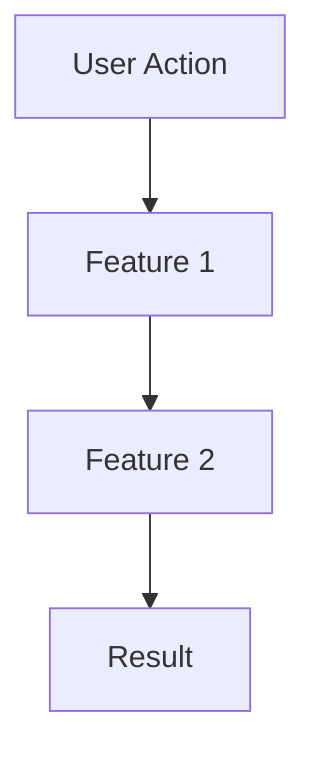
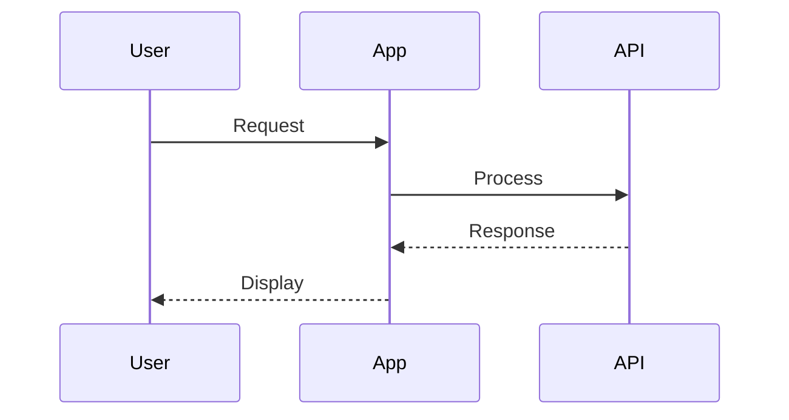

# Visualization Guide

This reference document describes how to use visualization tools in idea summaries.

---

## Config-Driven Visualization

Check `x-ipe-docs/config/tools.json` before choosing visualization method:

```yaml
decision_tree:
  - check: "config.stages.ideation.ideation.antv-infographic"
    if_true: "Use infographic DSL"
    use_for: "Feature lists, roadmaps, comparisons"
    
  - check: "config.stages.ideation.ideation.mermaid"
    if_true: "Use mermaid diagrams"
    use_for: "Flowcharts, sequences, state diagrams"
    
  - check: "config.stages.ideation.ideation.x-ipe-tool-architecture-dsl"
    if_true: "Use architecture DSL"
    use_for: "Layered architecture, module views"
    
  - fallback: "Use standard markdown"
    use_for: "Bullet lists, tables"
```

---

## Infographic Templates

| Use Case | Template | When to Use |
|----------|----------|-------------|
| Feature List | `list-grid-badge-card` | Listing key features with icons |
| Roadmap | `sequence-roadmap-vertical-simple` | Implementation phases |
| Comparison | `compare-binary-horizontal-badge-card-arrow` | Comparing options |

### Feature List Example

```infographic
infographic list-grid-badge-card
data
  title Key Features
  lists
    - label Feature 1
      desc Description of feature 1
      icon flash
    - label Feature 2
      desc Description of feature 2
      icon shield
```

### Roadmap Example

```infographic
infographic sequence-roadmap-vertical-simple
data
  title Implementation Phases
  lists
    - label Phase 1
      desc MVP with core features
    - label Phase 2
      desc User feedback integration
    - label Phase 3
      desc Scale and optimize
```

---

## Mermaid Diagrams

| Use Case | Diagram Type | When to Use |
|----------|--------------|-------------|
| User Flow | flowchart | Step-by-step user journey |
| Process | sequenceDiagram | System interactions |
| States | stateDiagram | State transitions |

### Flowchart Example



### Sequence Example



---

## Architecture DSL

Use for layered architecture when `x-ipe-tool-architecture-dsl` is enabled:

```architecture-dsl
@startuml module-view
title "System Architecture"
theme "theme-default"
direction top-to-bottom
grid 12 x 6

layer "Frontend" {
  color "#fce7f3"
  border-color "#ec4899"
  rows 2
  module "Web" { cols 12, rows 2, grid 1 x 1, component "React App" { cols 1, rows 1 } }
}

layer "Backend" {
  color "#dbeafe"
  border-color "#3b82f6"
  rows 2
  module "Services" { cols 12, rows 2, grid 2 x 1, component "API" { cols 1, rows 1 }, component "Workers" { cols 1, rows 1 } }
}

@enduml
```

---

## Fallback (No Tools Enabled)

When all visualization tools are disabled, use standard markdown:

### Feature List (Fallback)
```markdown
## Key Features

- **Feature 1:** Description of feature 1
- **Feature 2:** Description of feature 2
- **Feature 3:** Description of feature 3
```

### Comparison (Fallback)
```markdown
| Option | Pros | Cons |
|--------|------|------|
| Option A | Fast, cheap | Limited features |
| Option B | Full features | Slower, expensive |
```

### Process (Fallback)
```markdown
## Process Flow

1. User logs in
2. Dashboard loads
3. User selects action
4. System processes
5. Result displayed
```
