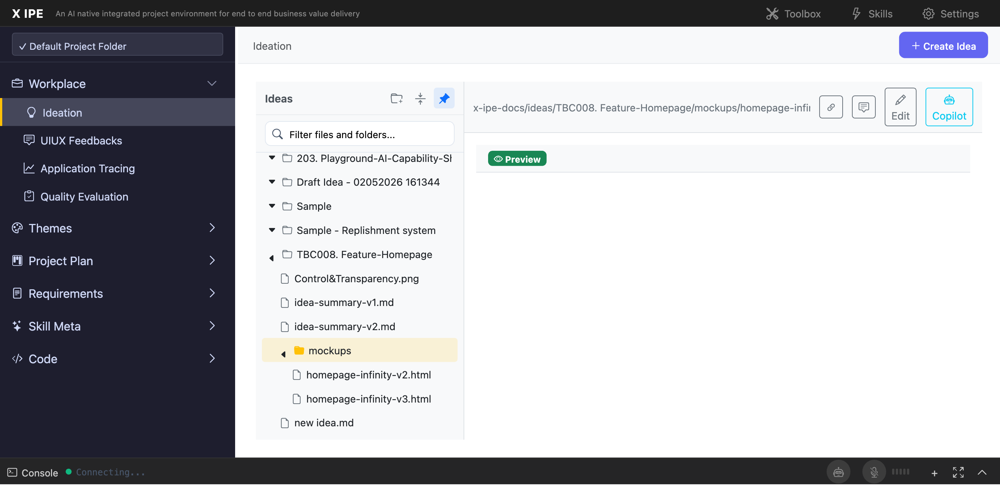

# UI/UX Feedback

**ID:** Feedback-20260205-202357
**URL:** http://127.0.0.1:5858/
**Date:** 2026-02-05 20:24:54

## Selected Elements

- `{'selector': '#workplace-content-body', 'parents': ['div#content-body', 'div.workplace-container', 'div#workplace-content', 'div.workplace-editor']}`

## Feedback

when I view mockup in ideas preview, you will see the background in mockup is broken, you can preproduce it with chrome devtools

## Screenshot

