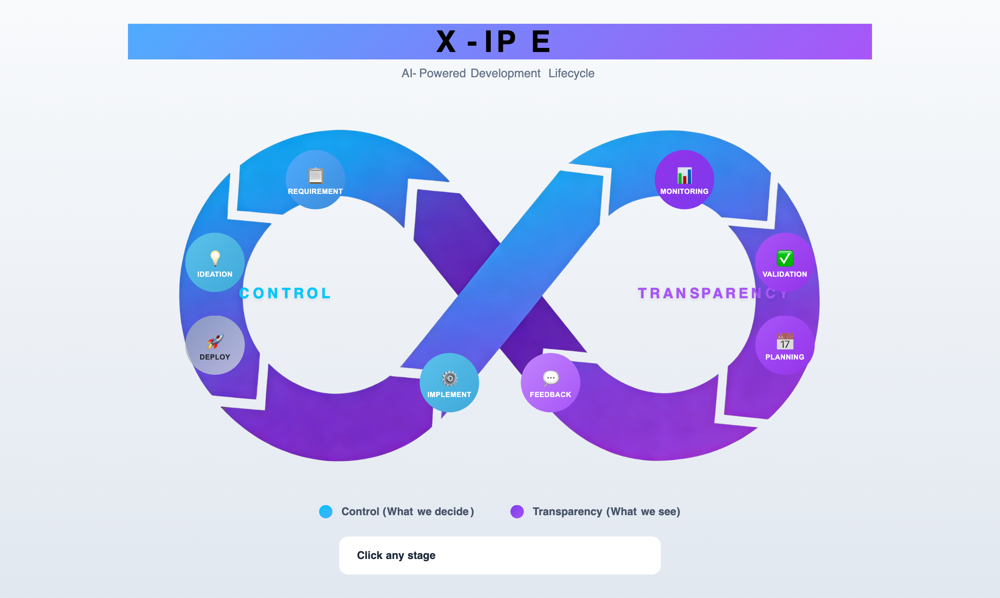

# UI/UX Feedback

**ID:** Feedback-20260205-204437
**URL:** idea://TBC008. Feature-Homepage/mockups/homepage-infinity-v3.html
**Date:** 2026-02-05 20:46:02

## Selected Elements

- `{'selector': 'button.stage-btn:nth-of-type(2)', 'parents': ['div.container', 'div.infinity-wrapper']}`

## Feedback

let's make all these icons drag and moviable, and have a color pick on the right corner, so I can select the button to pick the color

## Screenshot

