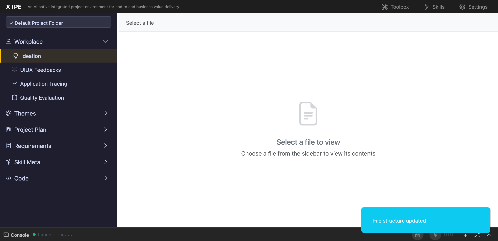

# UI/UX Feedback

**ID:** Feedback-20260205-232809
**URL:** http://127.0.0.1:5858/
**Date:** 2026-02-05 23:29:57

## Selected Elements

- `{'selector': '#toast-1770305285295', 'parents': ['div#toast-container']}`

## Feedback

when file structure updated notification popup, the sidebar menu alway auto collapsed, and no pins are gone, expectation, should not auto collapse, and pin should retain

## Screenshot

