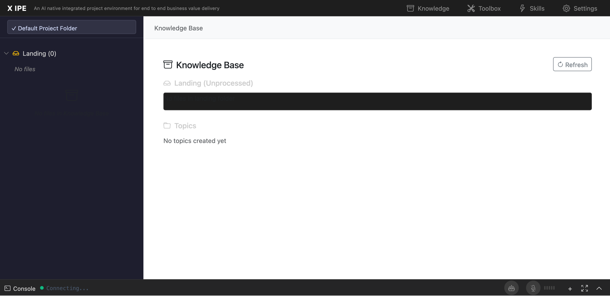

# UI/UX Feedback

**ID:** Feedback-20260206-002219
**URL:** http://127.0.0.1:5858/
**Date:** 2026-02-06 00:24:00

## Selected Elements

- `{'selector': 'div.kb-file-tree', 'parents': ['div#page-root', 'div#middle-section', 'nav#sidebar', 'div#sidebar-content']}`

## Feedback

for the sidebar in knowledge base, why not let's just keep the similar layout as ideation view which idea tree is in right content view. why not the folder tree view for knowledge base use the similar layout

## Screenshot

