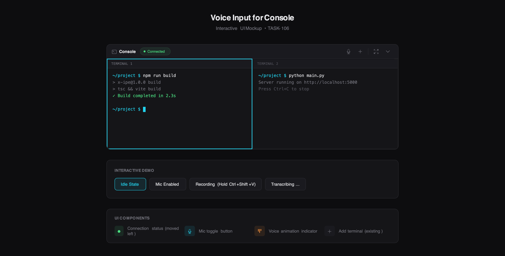

# UI/UX Feedback

**ID:** Feedback-20260209-170405
**URL:** idea://001. Feature-Console Voice Input - 01242026 000728/mockup.html
**Date:** 2026-02-09 17:04:54

## Selected Elements

- `{'selector': 'div.connection-status', 'parents': ['div.mockup-container', 'div.console-panel', 'div.console-header', 'div.header-left']}`

## Feedback

把这个connected这个状态栏放到最右边，且连通时颜色改为粉色

## Screenshot

