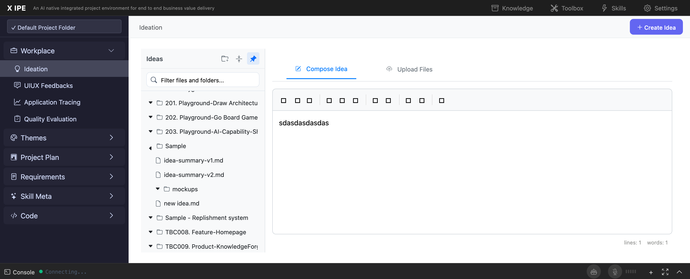

# UI/UX Feedback

**ID:** Feedback-20260209-170854
**URL:** http://127.0.0.1:5858
**Date:** 2026-02-09 17:10:09

## Selected Elements

- `{'selector': 'div.editor-toolbar', 'parents': ['div#ideaTabContent', 'div#compose-pane', 'div.workplace-compose', 'div.EasyMDEContainer']}`

## Feedback

looks like if viewport is small, the save button under textbox will out of viewport, expection: save button should always show at button of the viewport

## Screenshot

