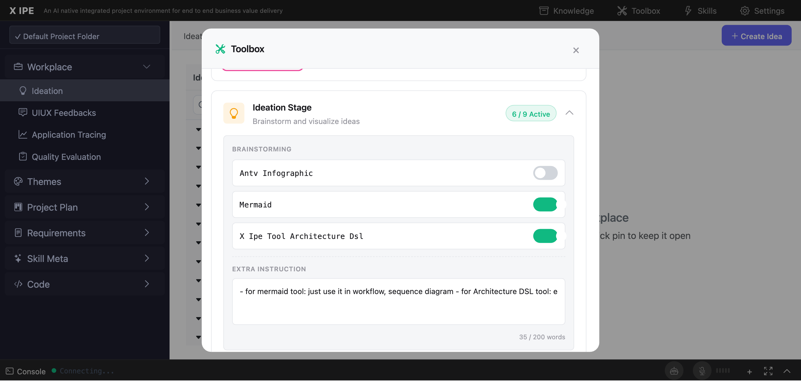

# UI/UX Feedback

**ID:** Feedback-20260210-141741
**URL:** http://127.0.0.1:5858/
**Date:** 2026-02-10 14:20:16

## Selected Elements

- `{'selector': 'div.toolbox-accordion-body', 'parents': ['div.toolbox-modal-body', 'div#toolbox-stages-container', 'div.toolbox-accordion.expanded', 'div.toolbox-accordion-content']}`

## Feedback

the expended contents it maybe very long, and it may continuously grow longer, so for the outer container, you can either choose to have scrollbar for each stage or you should base on the content to expend the outer container. now the outer container it just hard cut off the inner content, which is not expected

## Screenshot

