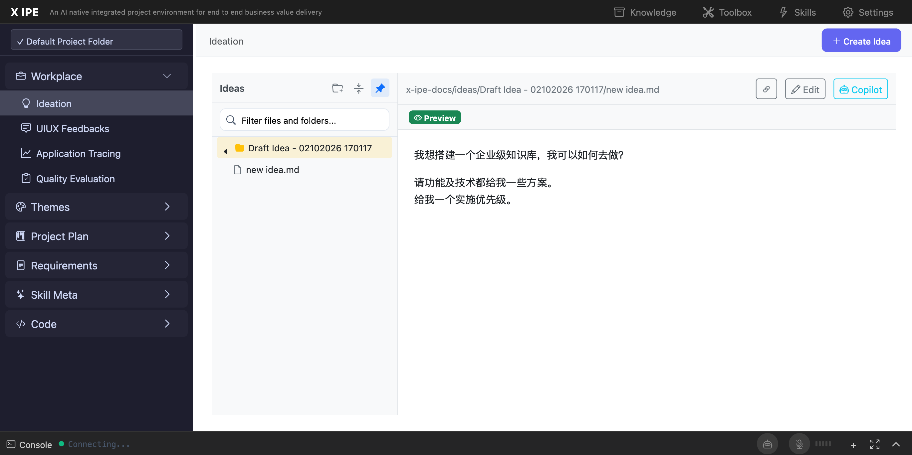

# UI/UX Feedback

**ID:** Feedback-20260210-172238
**URL:** http://127.0.0.1:6060/
**Date:** 2026-02-10 17:24:36

## Selected Elements

- `{'selector': '#workplace-copilot-btn', 'parents': ['div.workplace-editor', 'div.workplace-editor-header', 'div.workplace-editor-actions', 'div#copilot-btn-container']}`

## Feedback

as you can see I started another x-ipe in 6060, when I hover copilot, there is no prompt, I just wonder, maybe because the tools.json is not reading from project root/x-ipe-docs/config folder

## Screenshot

