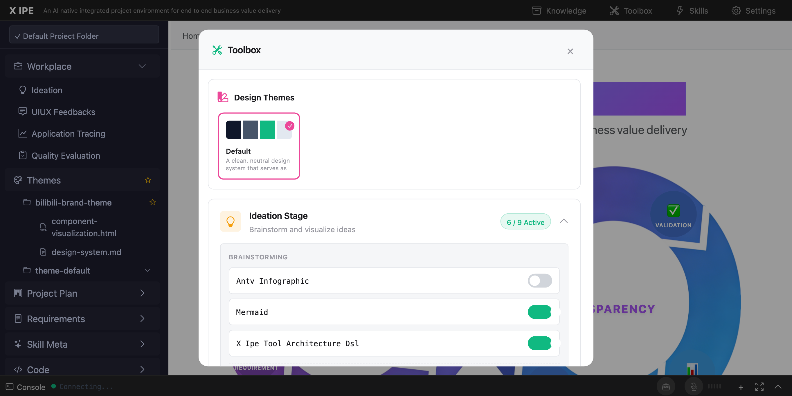

# UI/UX Feedback

**ID:** Feedback-20260210-180937
**URL:** http://127.0.0.1:5959/
**Date:** 2026-02-10 18:11:50

## Selected Elements

- `{'selector': 'span:nth-child(2)', 'parents': ['div#page-root', 'header.top-menu', 'div.brand']}`
- `{'selector': '#themes-grid', 'parents': ['div#stage-toolbox-modal', 'div.toolbox-modal', 'div.toolbox-modal-body', 'div.toolbox-themes-section']}`

## Feedback

as you can see for another x-ipe webapp running under 5959, when there is a brand theme created, it should showing in toolbox. 5959 is running using x-ipe serve, maybe because theme in toolbox it's not detect from project root/x-ipe-docs/themes folder

## Screenshot

