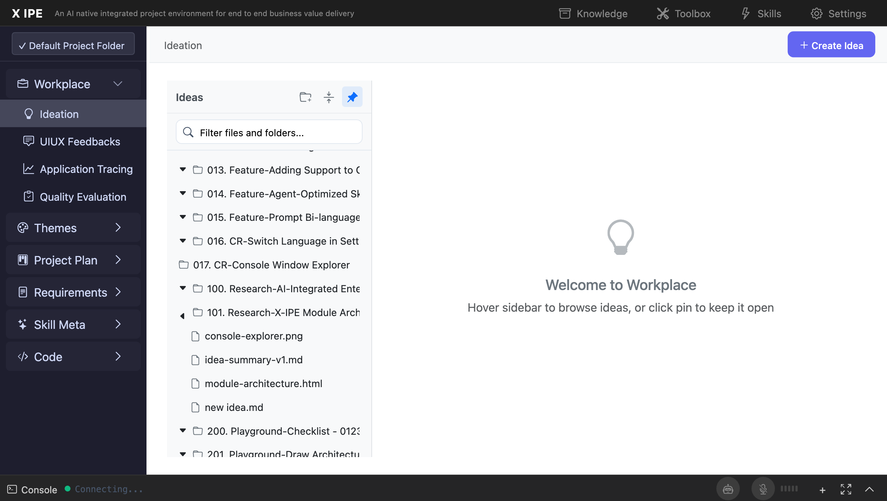

# UI/UX Feedback

**ID:** Feedback-20260211-181302
**URL:** http://127.0.0.1:5858/
**Date:** 2026-02-11 18:14:20

## Selected Elements

- `{'selector': 'span.workplace-tree-name', 'parents': ['div#workplace-tree', 'ul.workplace-tree-list.workplace-tree-root', 'li.workplace-tree-item.tree-item', 'div.workplace-tree-item-content.idea-folder-node']}`

## Feedback

I try to drag console-explorer from existing folder to 017. CR-Console Window Explorer. nothing happened, expecation: the file should be moved to the target folder

## Screenshot

