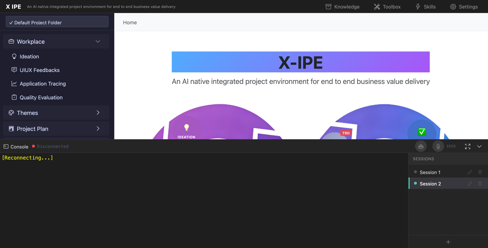

# UI/UX Feedback

**ID:** Feedback-20260212-182906
**URL:** http://127.0.0.1:5858/
**Date:** 2026-02-12 18:31:01

## Selected Elements

- `{'selector': '#explorer-add-btn', 'parents': ['div#page-root', 'div#terminal-panel', 'div#terminal-body', 'div#session-explorer']}`

## Feedback

the add session + icon should on sessions header instead of at botton, and base on mock up there should be a toggle to expend or close session explorer. 2. when in zen mode, still need to show session explorer if the toggle is on

## Screenshot

