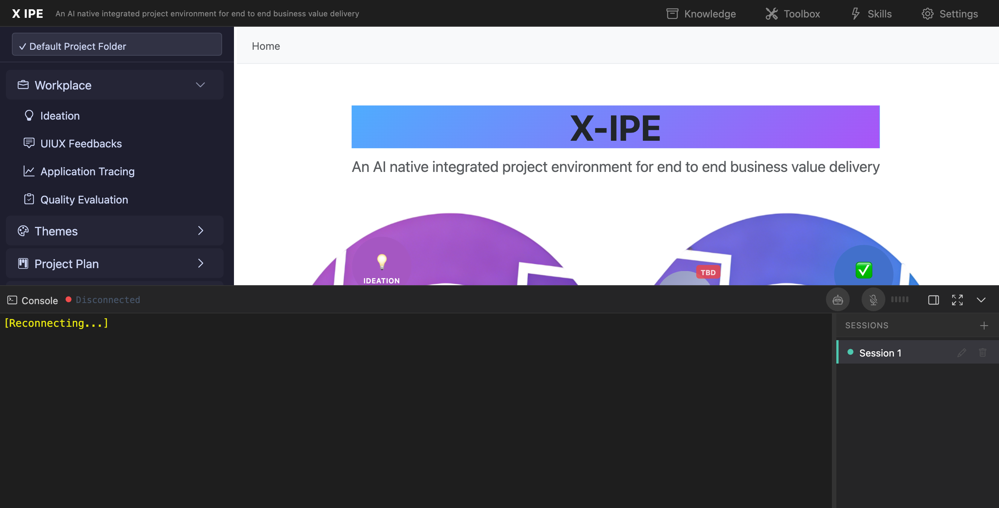

# UI/UX Feedback

**ID:** Feedback-20260212-212638
**URL:** http://127.0.0.1:5858
**Date:** 2026-02-12 21:27:13

## Selected Elements

- `{'selector': 'i.bi', 'parents': ['div#page-root', 'header.top-menu', 'div.menu-actions', 'button#btn-knowledge-base']}`

## Feedback

when we click on delete icon, it should recycle terminal session

## Screenshot

