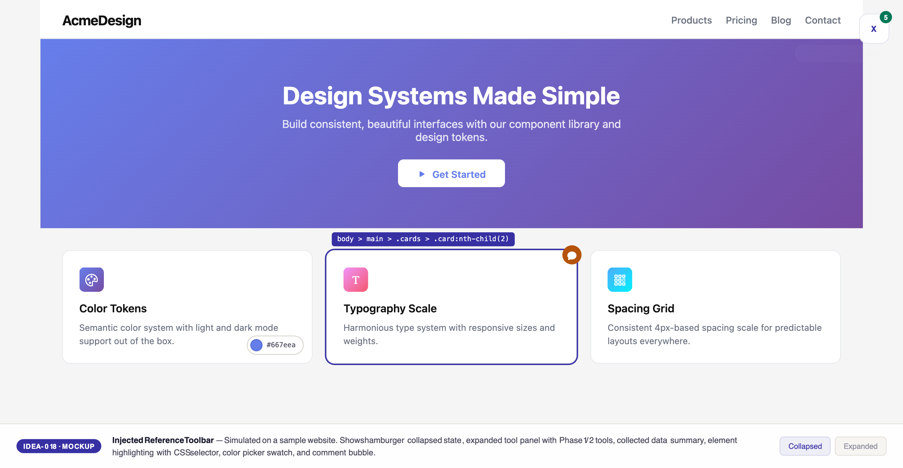

# UI/UX Feedback

**ID:** Feedback-20260213-162737
**URL:** idea://018. Feature-UIUX Reference/mockups/injected-toolbar-v2.html
**Date:** 2026-02-13 16:29:22

## Selected Elements

- `{'selector': '#xipe-hamburger', 'parents': ['div#xipe-toolbar']}`

## Feedback

for this floating ICON for x-ipe inject tools, can we have it as a cycle? and instead call it X, let's call it X-IPE and make at fancy, for example if I hover it will changing background color

## Screenshot

