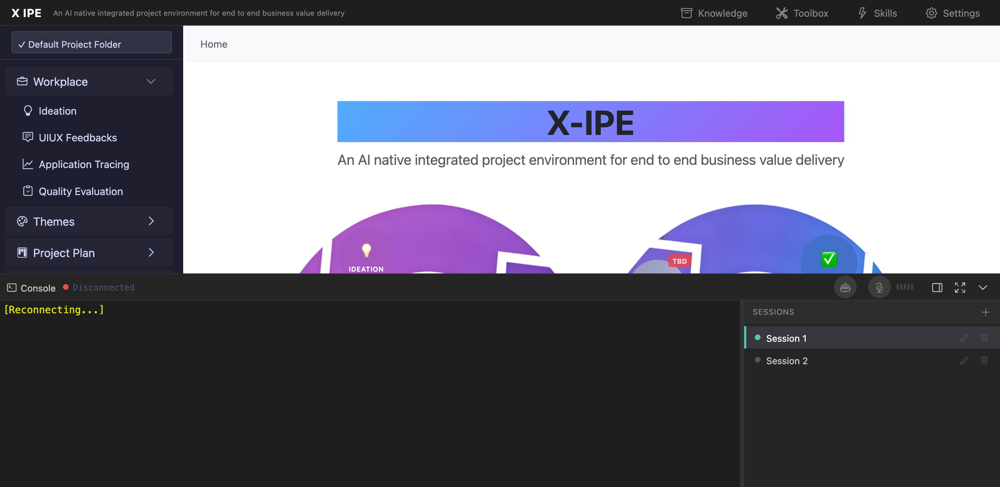

# UI/UX Feedback

**ID:** Feedback-20260213-235226
**URL:** http://127.0.0.1:5858/
**Date:** 2026-02-13 23:55:37

## Selected Elements

- `{'selector': 'div.xterm-rows', 'parents': ['div#terminal-content', 'div.terminal-session-container.active', 'div.terminal.xterm', 'div.xterm-screen']}`

## Feedback

when we have copilot cli is running in console window. when the content is over the viewport, and I try to scroll up during it's processing, it will force the scroll to the bottom, the expectation is if I trigger scroll event actively, only reset scroll to bottom after 5 seconds with new content coming

## Screenshot

