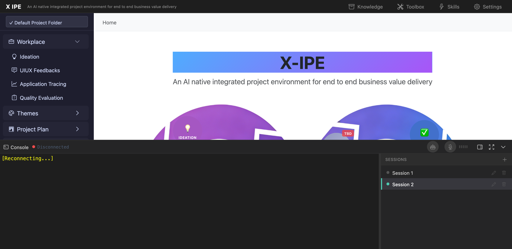

# UI/UX Feedback

**ID:** Feedback-20260215-211648
**URL:** http://127.0.0.1:5858/
**Date:** 2026-02-15 21:18:11

## Selected Elements

- `{'selector': 'i.bi', 'parents': ['div#page-root', 'header.top-menu', 'div.menu-actions', 'button#btn-knowledge-base']}`

## Feedback

looks like the delete icon in the session list won't delete the session behind, so it becomes orphaned session after that. expect, whe delete terminal window, delete underlying session as well.

## Screenshot

