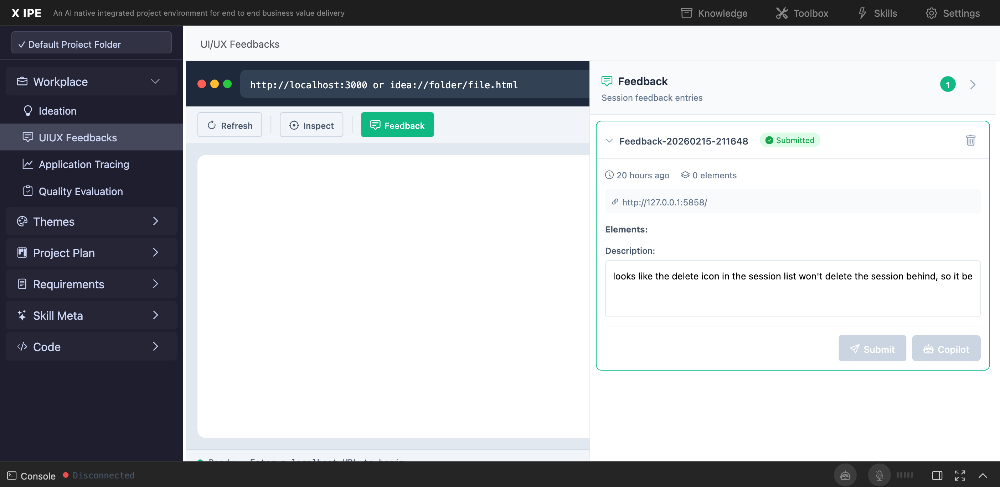

# UI/UX Feedback

**ID:** Feedback-20260216-171908
**URL:** http://127.0.0.1:5858/
**Date:** 2026-02-16 17:24:44

## Selected Elements

- `{'selector': 'div.entry-url', 'parents': ['aside#feedback-panel', 'div#feedback-list', 'div.feedback-entry.expanded', 'div.feedback-entry-body']}`

## Feedback

there are several bugs with the uiux feedback function. 1. the screenshot should be the area of the simulator bowser area(the current implementation looks like try to learn the dom elements then take the screenshot, but the expectation is you should  use more simple and effecient way to do it), you can check the implementation in uiux reference skill see how it does, that implementation is better, so we can implement here as well. 2. the already feedbacked item it's no loading it's screenshot.

## Screenshot

