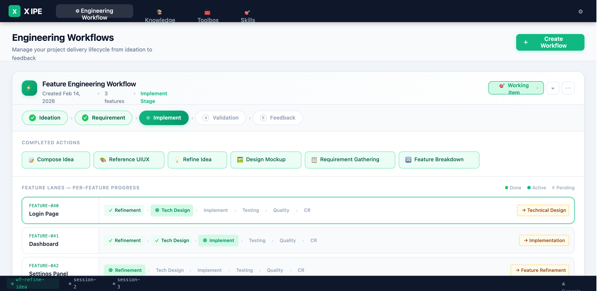

# UI/UX Feedback

**ID:** Feedback-20260217-170833
**URL:** idea://021. Feature-Engineering-Workflow/mockups/workflow-view-v1.html
**Date:** 2026-02-17 17:10:26

## Selected Elements

- `{'selector': 'div.lane-label', 'parents': ['div.wf-panel-body', 'div.feature-lanes-area', 'div.lanes-container', 'div.feature-lane.highlighted']}`

## Feedback

for the features, do you have a way to show dependencies, and also have indicator to show the suggested parallel run. please update the mockup and also update it's related idea summary to mention the function

## Screenshot

