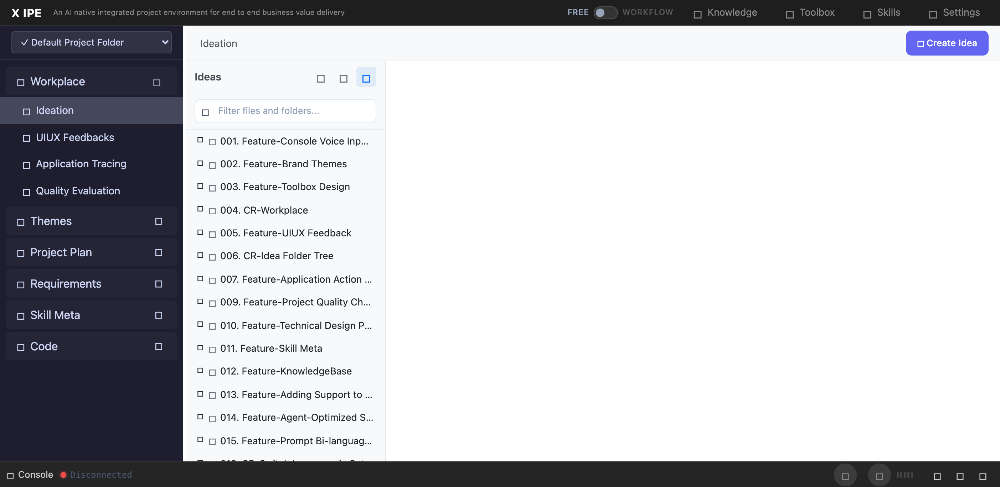

# UI/UX Feedback

**ID:** Feedback-20260219-173237
**URL:** http://127.0.0.1:5858/
**Date:** 2026-02-19 17:34:41

## Selected Elements

- `{'selector': '#workplace-tree', 'parents': ['div#content-body', 'div.workplace-container', 'div#workplace-sidebar', 'div.workplace-sidebar-content']}`

## Feedback

when I go to workflow mode, then switch back and go to ideation, you will find the idea tree within ideation view has no scrollbar any more. if I don't go to workflow mode, the idea tree is working as expected which having scrollbar when the tree cannot fit into view port

## Screenshot

