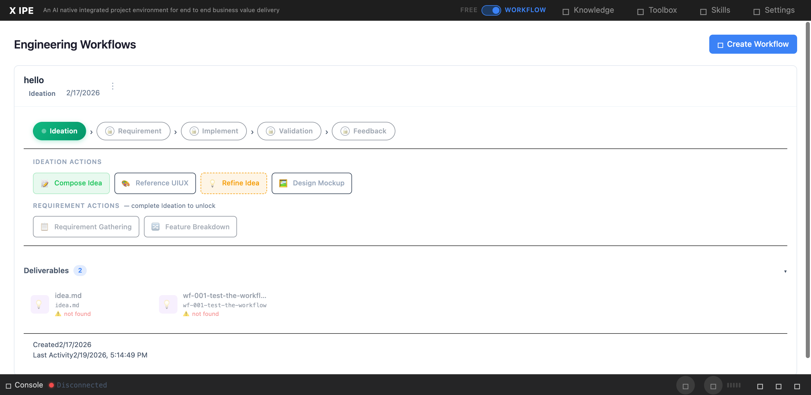

# UI/UX Feedback

**ID:** Feedback-20260219-174743
**URL:** http://127.0.0.1:5858/
**Date:** 2026-02-19 17:49:12

## Selected Elements

- `{'selector': 'div.deliverables-area', 'parents': ['div#content-body', 'div#workflow-panels', 'div.workflow-panel.expanded', 'div.workflow-panel-body']}`

## Feedback

after composing idea, I found the deliverable still says not found, but I checked the actual data is there under x-ipe-docs/ideas. 2. the idea file should keep consistency when we create it, it should be called new idea.md

## Screenshot

