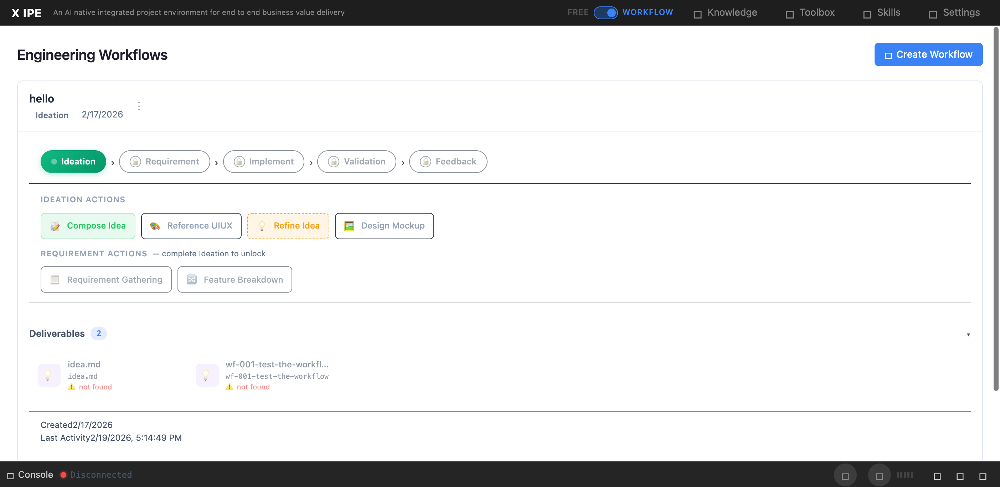

# UI/UX Feedback

**ID:** Feedback-20260220-133807
**URL:** http://127.0.0.1:5858/
**Date:** 2026-02-20 13:38:54

## Selected Elements

- `{'selector': 'div.deliverables-grid', 'parents': ['div#workflow-panels', 'div.workflow-panel.expanded', 'div.workflow-panel-body', 'div.deliverables-area']}`

## Feedback

i see the deliverables exists but it still says not found

## Screenshot

