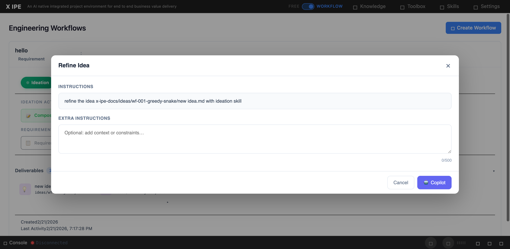

# UI/UX Feedback

**ID:** Feedback-20260221-194456
**URL:** http://127.0.0.1:5858/
**Date:** 2026-02-21 19:49:42

## Selected Elements

- `{'selector': 'div.instructions-content', 'parents': ['div.modal-overlay', 'div.modal-container', 'div.modal-body', 'div.instructions-section']}`

## Feedback

let's make a change to the refine idea modal window that, add a section called current selected idea, by default it should be the deliverable idea file from compose idea, but also list the idea file from refined-idea folder(in this case the ideas in refine-idea folder maybe generated before by refine idea, but reopenned the action), so user can seletect which file they want to refine on. if they switch the file, the placeholder in the instruction should be replaced and in the instructions textbox it should show the correct file

## Screenshot

