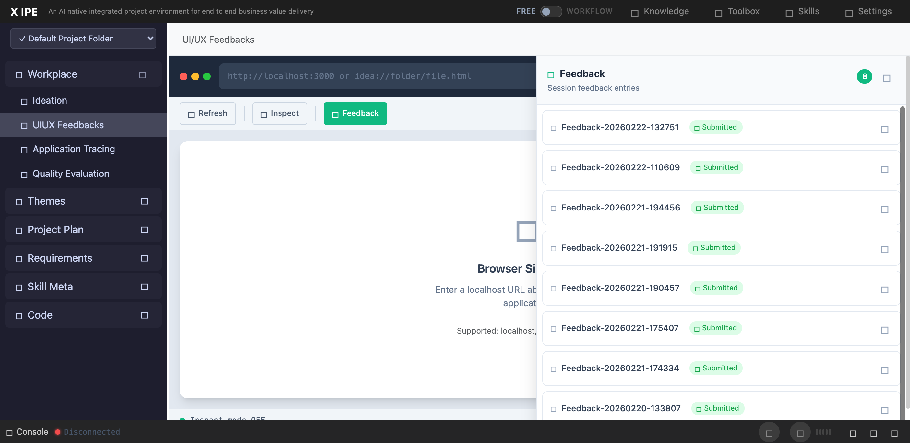

# UI/UX Feedback

**ID:** Feedback-20260222-133420
**URL:** http://127.0.0.1:5858/
**Date:** 2026-02-22 13:35:23

## Selected Elements

- `{'selector': 'div.feedback-entry-header', 'parents': ['div.uiux-container', 'aside#feedback-panel', 'div#feedback-list', 'div.feedback-entry.status-submitted']}`

## Feedback

for the feedback panel, let's have a copy icon beside delete icon, so I can copy the folder path of the submitted feedbacks

## Screenshot

