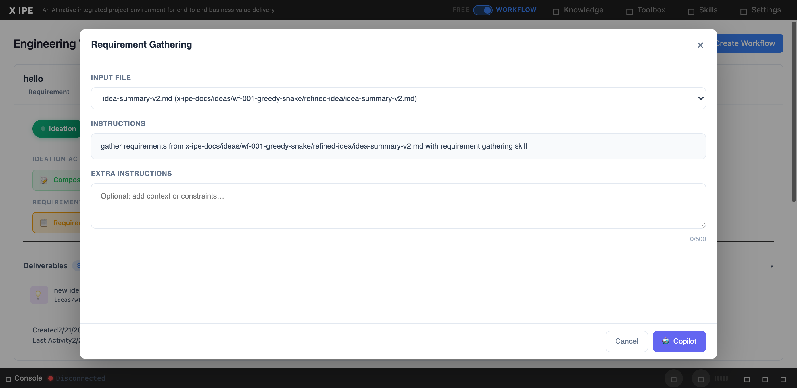

# UI/UX Feedback

**ID:** Feedback-20260222-161515
**URL:** http://127.0.0.1:5858/
**Date:** 2026-02-22 16:16:47

## Selected Elements

- `{'selector': 'div.modal-body', 'parents': ['div#skills-modal', 'div.modal-dialog.modal-lg', 'div.modal-content']}`

## Feedback

as you can see the modal window for gethering is correct, but for idea mockup action, it's still wrong, no input selection and no instructions detected

## Screenshot

