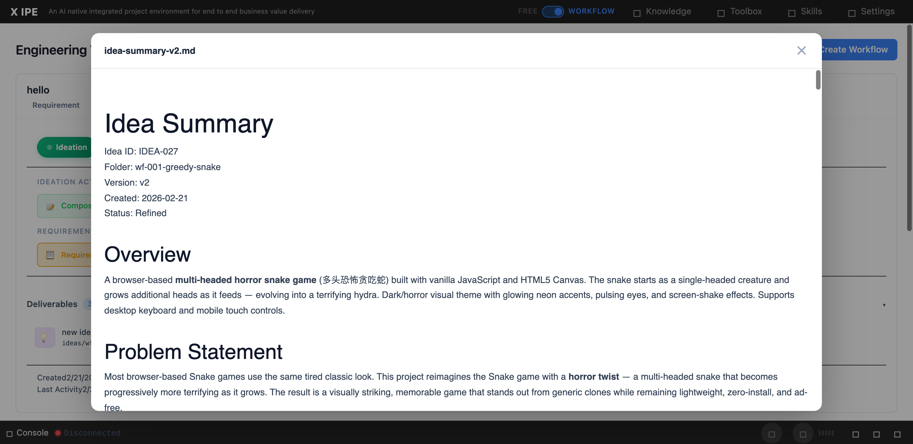

# UI/UX Feedback

**ID:** Feedback-20260224-093341
**URL:** http://127.0.0.1:5858/
**Date:** 2026-02-24 10:43:35

## Selected Elements

- `{'selector': 'div.preview-content', 'parents': ['div.deliverable-preview-backdrop.active', 'div.deliverable-preview']}`

## Feedback

I have two feedback for change, 1. the preview implementation for deliverable in workflow looks different then the preview implementation in the ideation view. 2. for html it's raw data preview in the workflow, it should also like preview in ideation to show the parsed content

## Screenshot

