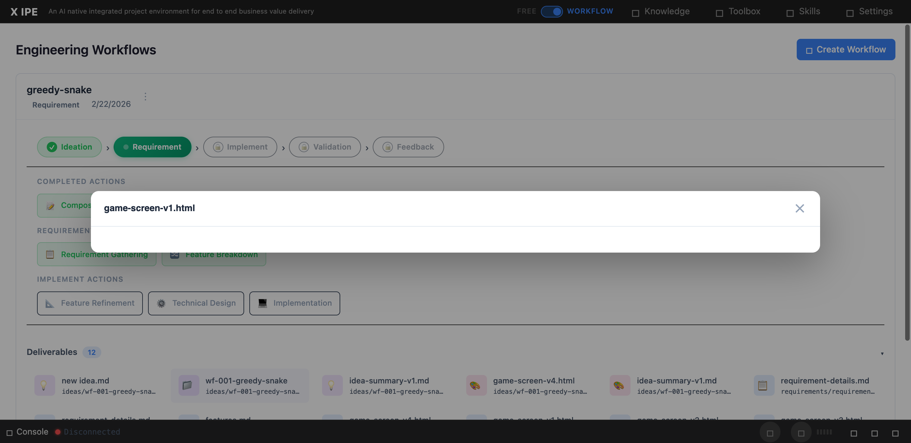

# UI/UX Feedback

**ID:** Feedback-20260224-111639
**URL:** http://127.0.0.1:5959/
**Date:** 2026-02-24 11:22:40

## Selected Elements

- `{'selector': 'div.preview-content', 'parents': ['div.deliverable-preview-backdrop.active', 'div.deliverable-preview']}`

## Feedback

the modal window height is too small for html, let's do this for all the modal window within workflow mode, let's share the same modal window component, and having 90% height of view port and 90% width of view port

## Screenshot

