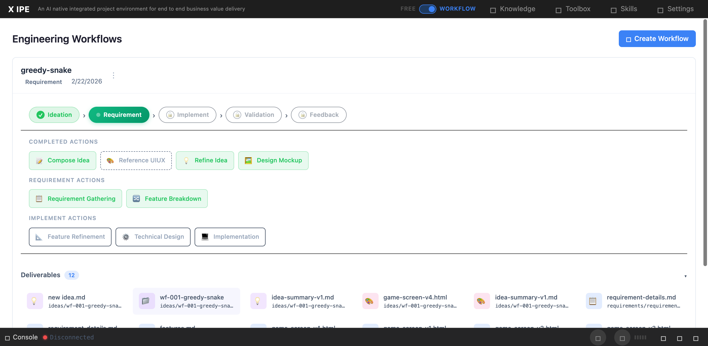

# UI/UX Feedback

**ID:** Feedback-20260224-113724
**URL:** http://127.0.0.1:5959/
**Date:** 2026-02-24 11:38:38

## Selected Elements

- `{'selector': 'button.action-btn:nth-of-type(2)', 'parents': ['div.workflow-panel-body', 'div.actions-area', 'div.action-group', 'div.actions-grid']}`

## Feedback

I remember we have a function that after feature breakdown action completes, it need to show the feature level panel right? can you double check for me?

## Screenshot

