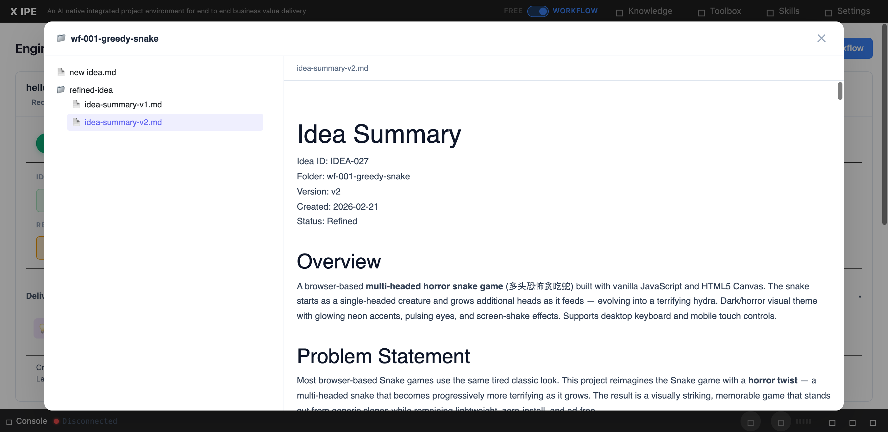

# UI/UX Feedback

**ID:** Feedback-20260224-125237
**URL:** http://127.0.0.1:5858
**Date:** 2026-02-24 12:54:44

## Selected Elements

- `{'selector': 'div.folder-browser-preview-content', 'parents': ['div.folder-browser-backdrop.active', 'div.folder-browser-modal', 'div.folder-browser-body', 'div.folder-browser-preview']}`

## Feedback

please double check, still the preview in deliverable in workflow mode is not the same as the preview function in ideation for markdown file, the overall style is different and the mermaid, architecture dsl ... supports are all not here. we need reuse the same preview capability from ideation for markdown

## Screenshot

