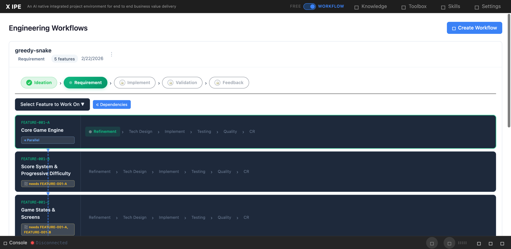

# UI/UX Feedback

**ID:** Feedback-20260224-131050
**URL:** http://127.0.0.1:5959/
**Date:** 2026-02-24 13:13:41

## Selected Elements

- `{'selector': 'div.lane-label', 'parents': ['div.workflow-panel.expanded', 'div.workflow-panel-body', 'div.lanes-container', 'div.feature-lane.highlighted']}`

## Feedback

1.the feature level ui should not be dark mode. 2. as you can see the dependency line is overlapping with the feature panel, it's urgly. any better way to represent the dependecy? 3. I can no longer see the shared action panel, which is not expected. I still need see the shared action panels.

## Screenshot

