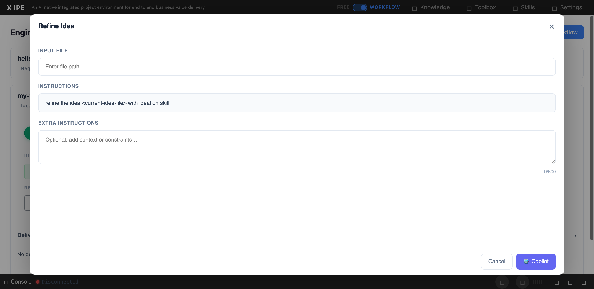

# UI/UX Feedback

**ID:** Feedback-20260224-153101
**URL:** http://127.0.0.1:5858/
**Date:** 2026-02-24 15:35:05

## Selected Elements

- `{'selector': 'input.input-path-manual', 'parents': ['div.modal-overlay', 'div.modal-container', 'div.modal-body', 'div.input-selector-section']}`

## Feedback

for refine idea action, when we open modal window, previously the input file here is a dropdown which auto select the idea file from deliverable of previous action, or when I reopen, it will able to select any previouse version of refined idea for continue work on them. now it's a text box, which is not expected. please check the history version to fix it. and for other actions I know now we share a same modal window component, please reference this feature as well. and also if other action have any customized requirement to adding fields, they should able to do it with out impact other action modal uiux

## Screenshot

