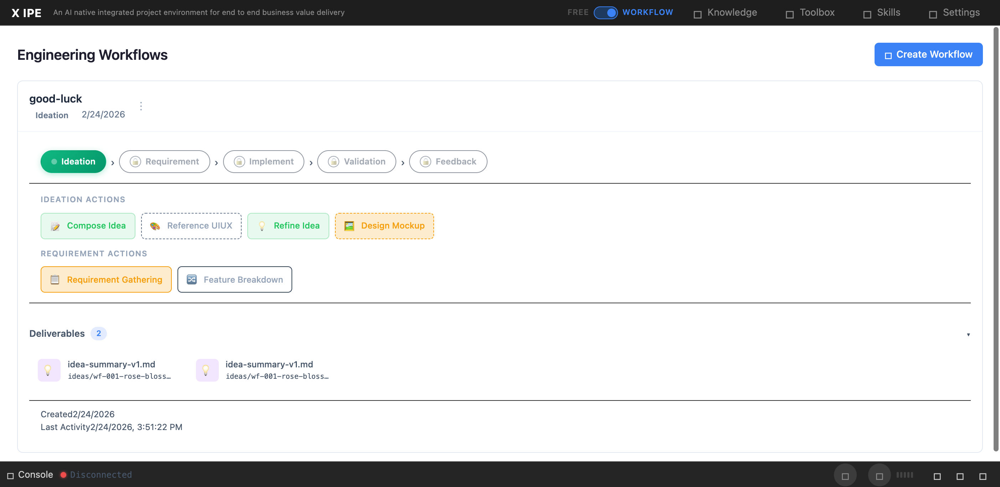

# UI/UX Feedback

**ID:** Feedback-20260224-155419
**URL:** http://127.0.0.1:5959/
**Date:** 2026-02-24 15:56:38

## Selected Elements

- `{'selector': 'div.deliverable-card:nth-of-type(1)', 'parents': ['div.workflow-panel.expanded', 'div.workflow-panel-body', 'div.deliverables-area', 'div.deliverables-grid']}`

## Feedback

after some bugs fixing, now deliverable in deliverables section no longer correct, compose_idea action deliverables has been overrided, and refine idea action should have folder as part of deliverable, but no longer there. you can reference file here: {
  "schema_version": "2.0",
  "name": "good-luck",
  "created": "2026-02-24T07:26:55.206591+00:00",
  "last_activity": "2026-02-24T07:51:22.316478+00:00",
  "idea_folder": null,
  "current_stage": "ideation",
  "shared": {
    "ideation": {
      "status": "in_progress",
      "actions": {
        "compose_idea": {
          "status": "done",
          "deliverables": [
            "x-ipe-docs/ideas/wf-001-rose-blossom-animation-web-app/refined-idea/idea-summary-v1.md"
          ],
          "next_actions_suggested": [
            "refine_idea",
            "reference_uiux"
          ]
        },
        "refine_idea": {
          "status": "done",
          "deliverables": [
            "x-ipe-docs/ideas/wf-001-rose-blossom-animation-web-app/refined-idea/idea-summary-v1.md"
          ],
          "next_actions_suggested": [
            "design_mockup",
            "requirement_gathering"
          ]
        },
        "reference_uiux": {
          "status": "pending",
          "deliverables": [],
          "optional": true
        },
        "design_mockup": {
          "status": "pending",
          "deliverables": [],
          "optional": true
        }
      }
    },
    "requirement": {
      "status": "locked",
      "actions": {
        "requirement_gathering": {
          "status": "pending",
          "deliverables": []
        },
        "feature_breakdown": {
          "status": "pending",
          "deliverables": [],
          "features_created": []
        }
      }
    }
  },
  "features": []
}

## Screenshot

