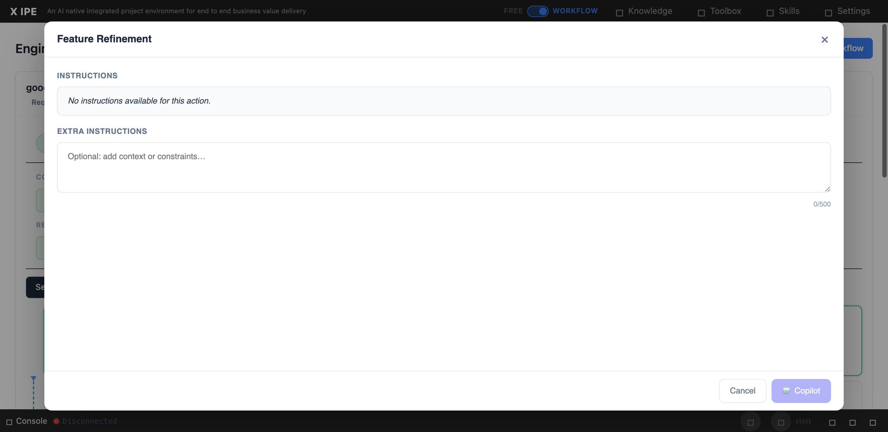

# UI/UX Feedback

**ID:** Feedback-20260225-160442
**URL:** http://127.0.0.1:5959/
**Date:** 2026-02-25 16:08:20

## Selected Elements

- `{'selector': 'div.modal-body', 'parents': ['div#skills-modal', 'div.modal-dialog.modal-lg', 'div.modal-content']}`

## Feedback

for feature refinement, technicial design ... all the actions we need the modal window logic the similar to refine idea, requirement gathering or feature breakdown, which having a input param section that listing all the input file dependencies. and for the related skills we need also update them to support workflows

## Screenshot

