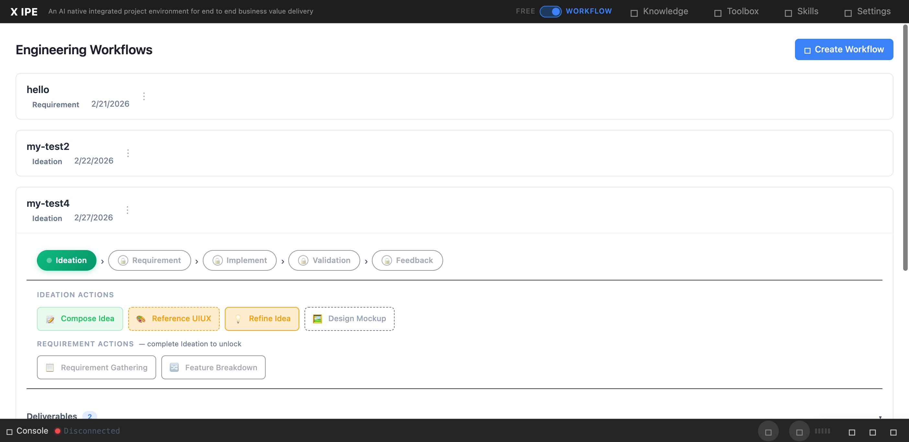

# UI/UX Feedback

**ID:** Feedback-20260302-102137
**URL:** http://127.0.0.1:5858/
**Date:** 2026-03-02 10:23:29

## Selected Elements

- `{'selector': 'button.workflow-action-btn', 'parents': ['div#workflow-panels', 'div.workflow-panel', 'div.workflow-panel-header', 'div.workflow-panel-actions']}`

## Feedback

the three dots should align on the right side. and when we click on 3 dots, it should popup a menu, it should contain delete workflow menu item. please also add logic for the button so I can delete it with the menu item

## Screenshot

