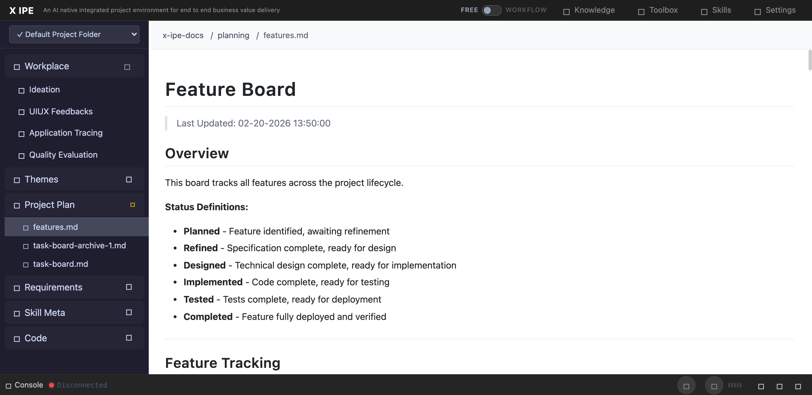

# UI/UX Feedback

**ID:** Feedback-20260303-212659
**URL:** http://127.0.0.1:5858/
**Date:** 2026-03-03 21:32:51

## Selected Elements

- `{'selector': 'a:nth-child(1)', 'parents': ['div#page-root', 'header.top-menu', 'div.brand']}`

## Feedback

let's create a new requirement, 1. for all the docs linked in markdown file which related to project, should have the full relative path to the project-root. 2. if it's start with x-ipe-docs folder, in x-ipe when we clicks on it, it should open a preview window instead of link redirect to other pages. 3. we need update all the skills which generate markdown file with x-ipe resource links, they need follow the change No.1 which generate full path. 4. update all existing file path within the markdown file

## Screenshot

