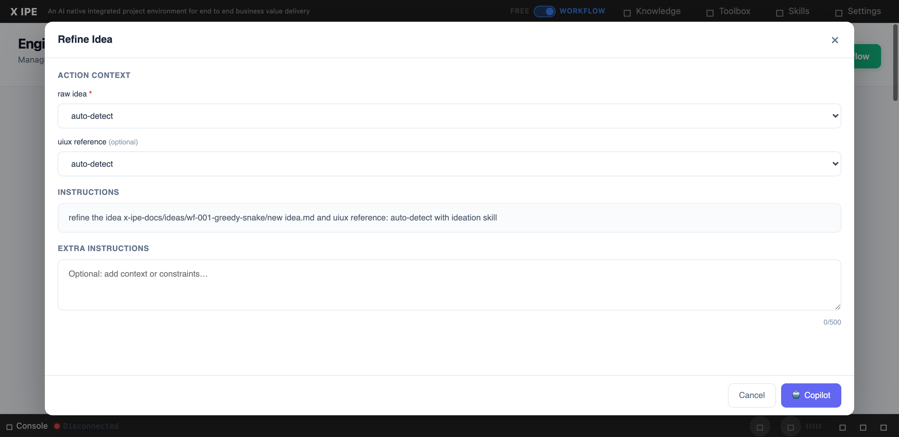

# UI/UX Feedback

**ID:** Feedback-20260304-224747
**URL:** http://127.0.0.1:5858/
**Date:** 2026-03-04 22:53:06

## Selected Elements

- `{'selector': 'select:nth-child(2)', 'parents': ['div.modal-container', 'div.modal-body', 'div.action-context-section', 'div.context-ref-group']}`

## Feedback

I found that the dropdown from context didn't include it's candidates, for example raw_idea, it need to load not only from raw-idea file tag, but since the candidates sets to folder tag 'ideas-folder', so it should also load files in the folder, here should be idea summary v1, v2..

## Screenshot

