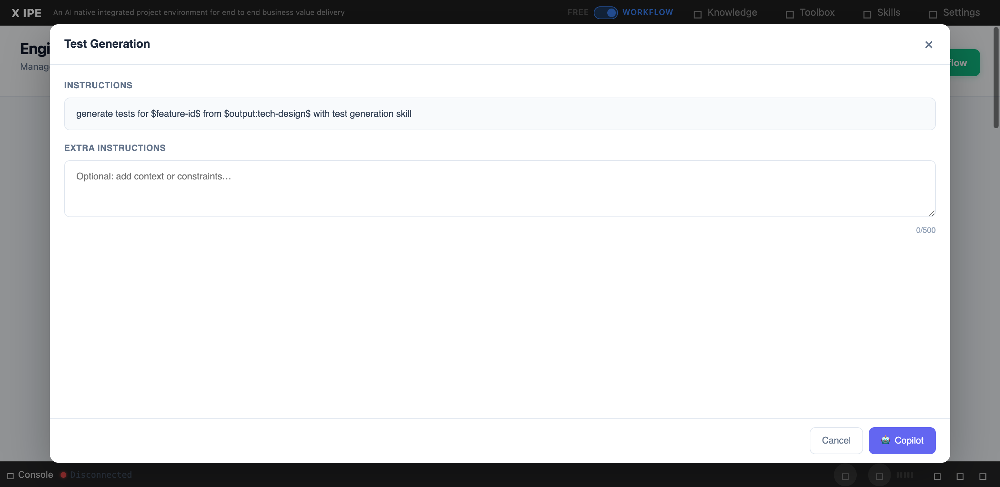

# UI/UX Feedback

**ID:** Feedback-20260305-093837
**URL:** http://127.0.0.1:5858/
**Date:** 2026-03-05 09:46:27

## Selected Elements

- `{'selector': 'div.modal-body', 'parents': ['div#skills-modal', 'div.modal-dialog.modal-lg', 'div.modal-content']}`

## Feedback

I found some actions has no action context section, which is wrong, I don't know if we have multi version template or not, but we don't need the version without action context, so please refer other actions with action context and see how it work with workflow-{name}.json and workflow-template.json and behind scene SKILLs

## Screenshot

