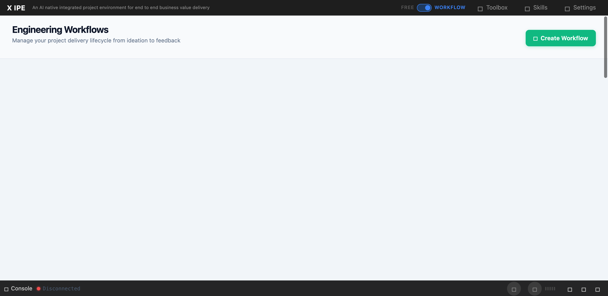

# UI/UX Feedback

**ID:** Feedback-20260305-120915
**URL:** http://127.0.0.1:5858/
**Date:** 2026-03-05 12:12:23

## Selected Elements

- `{'selector': 'div.deliverables-row', 'parents': ['div.workflow-panel-body', 'div.deliverables-area', 'div.deliverables-grid', 'div.deliverables-stage-section']}`

## Feedback

for deliverables from each features, we should have  feature section for each feature to listing it's deliverables, not just put everything in requirement deliverable section.

## Screenshot

