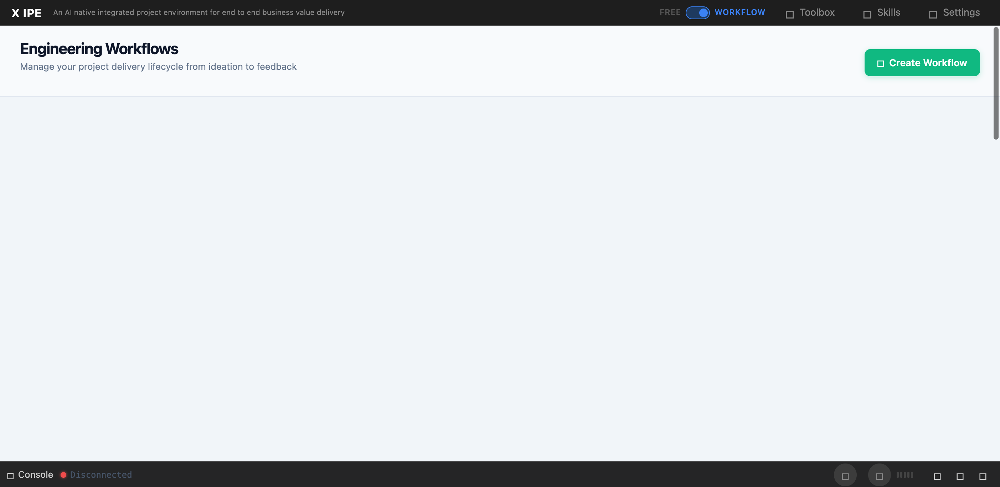

# UI/UX Feedback

**ID:** Feedback-20260305-125521
**URL:** http://127.0.0.1:5858/
**Date:** 2026-03-05 12:56:52

## Selected Elements

- `{'selector': 'div.feature-lanes-area', 'parents': ['div#content-body', 'div#workflow-panels', 'div.workflow-panel.expanded', 'div.workflow-panel-body']}`

## Feedback

please check why screenshot capability from uiux feedback cannot catch the view properly, you can use chrome devtool to do a comparison, looks like there are some issue with the function

## Screenshot

