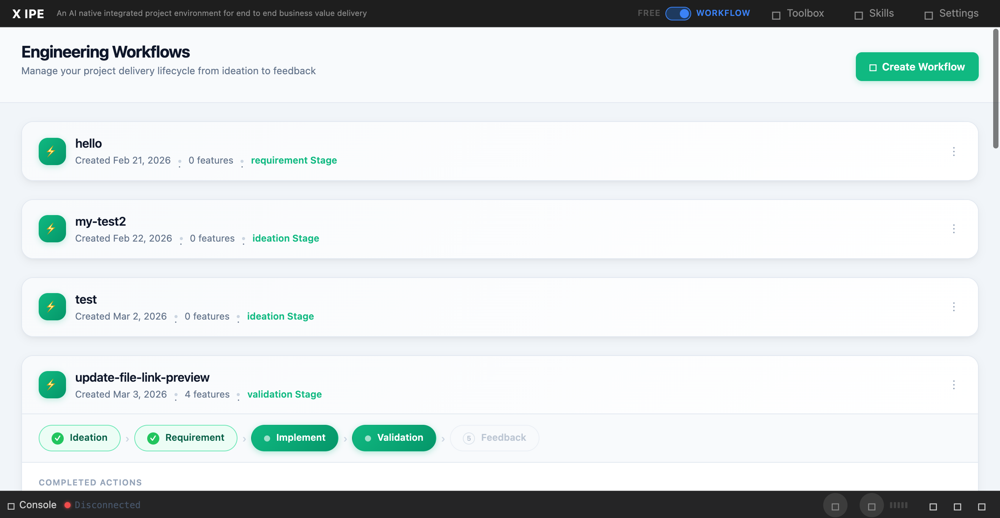

# UI/UX Feedback

**ID:** Feedback-20260307-090240
**URL:** http://127.0.0.1:5858/
**Date:** 2026-03-07 09:05:04

## Selected Elements

- `{'selector': 'button.btn', 'parents': ['div#middle-section', 'main.content-area', 'div.content-header', 'div.header-actions.d-flex']}`

## Feedback

let's adjust the auto-proceed dropdown position, since it's no longer only for feature level actions, now it's for all possible actions, so let's move it to the workflow panel bar, besides 3 dots

## Screenshot

