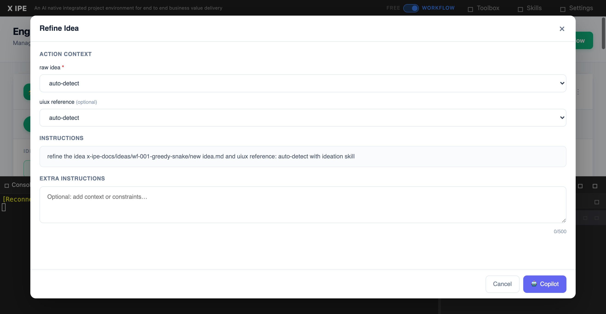

# UI/UX Feedback

**ID:** Feedback-20260307-190453
**URL:** http://127.0.0.1:5858/
**Date:** 2026-03-07 19:07:35

## Selected Elements

- `{'selector': 'div.instructions-content', 'parents': ['div.modal-overlay', 'div.modal-container', 'div.modal-body', 'div.instructions-section']}`

## Feedback

if the workflow auto-proceed dropdown set the value to auto or stop on question, then the instruction should append --execution@{keep running or keep running stop only on question} accordingly

## Screenshot

