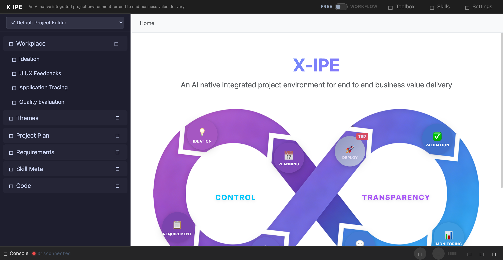

# UI/UX Feedback

**ID:** Feedback-20260307-232835
**URL:** http://127.0.0.1:5858/
**Date:** 2026-03-07 23:29:22

## Selected Elements

- `{'selector': 'div.nav-section-header', 'parents': ['div#middle-section', 'nav#sidebar', 'div#sidebar-content', 'div.nav-section']}`

## Feedback

now when I hover on the sidemenu, it will auto expend the menu, but I expect no auto expend

## Screenshot

