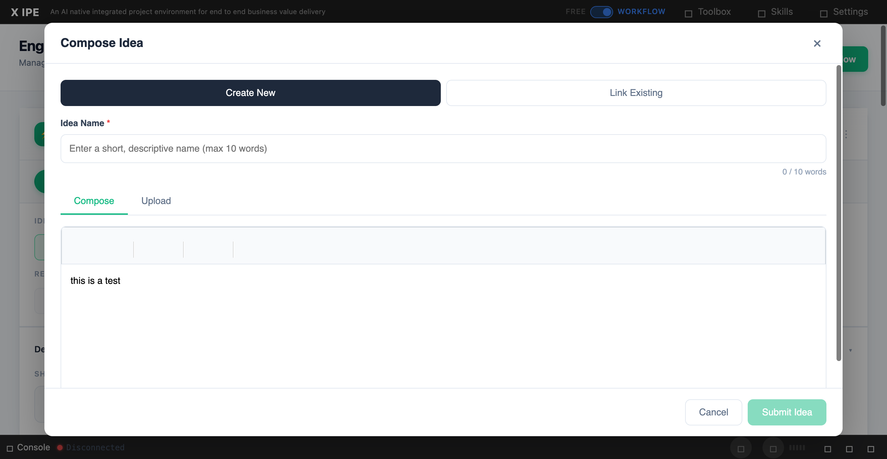

# UI/UX Feedback

**ID:** Feedback-20260308-094212
**URL:** http://127.0.0.1:5858/
**Date:** 2026-03-08 09:44:04

## Selected Elements

- `{'selector': '#compose-idea-name', 'parents': ['div.compose-modal', 'div.compose-modal-body', 'div.compose-modal-create-content', 'div.compose-modal-name']}`

## Feedback

since now idea name will be auto fill for example here is 'workflow-test', I found a bug, which eventhough everything has been filled, but I still need to edit the textbox then I can click submit idea

## Screenshot

