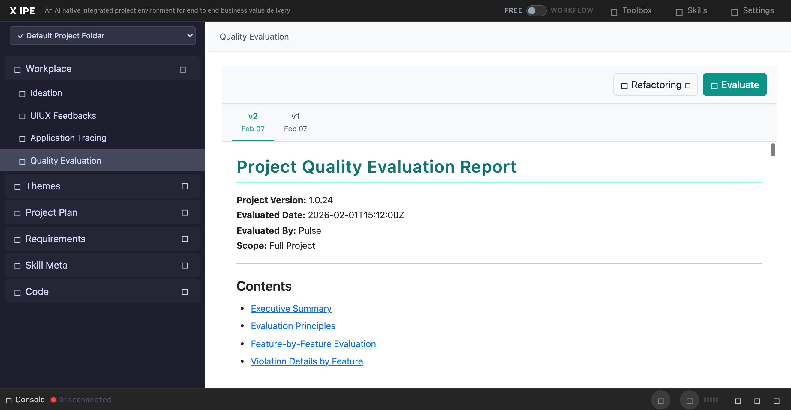

# UI/UX Feedback

**ID:** Feedback-20260308-162624
**URL:** http://127.0.0.1:5858/
**Date:** 2026-03-08 16:26:51

## Selected Elements

- `{'selector': 'div.dropdown-item:nth-of-type(1)', 'parents': ['div.quality-eval-view', 'div.quality-action-bar', 'div.dropdown-refactoring', 'div.dropdown-menu']}`

## Feedback

looks like the text in the refactoring dropdown is gone, fix it

## Screenshot

