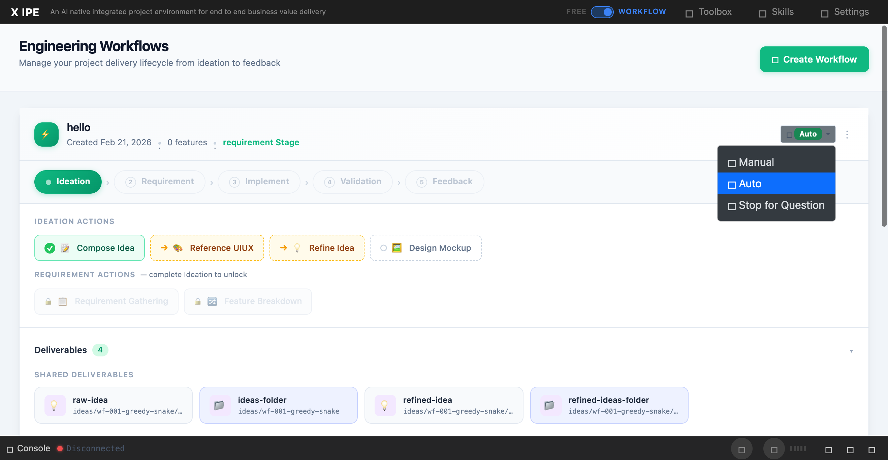

# UI/UX Feedback

**ID:** Feedback-20260309-111628
**URL:** http://127.0.0.1:5858/
**Date:** 2026-03-09 11:57:09

## Selected Elements

- `{'selector': 'button.btn', 'parents': ['div#middle-section', 'main.content-area', 'div.content-header', 'div.header-actions.d-flex']}`

## Feedback

Let's start a CR, why not we make auto proceed mode more explicitly, since the idea for auto proceed is let skill x-ipe-dao-end-user-representative to overtake my instructions or feedbacks. so let's do following change.
1. we no longer call it auto_proceed mode, we call it End-User Representative Mode.
for example: the input in skill 
process_preference:
  interaction_mode: {interact-with-end-user prepresentative-DAO | interact-with-end-user prepresentative-DAO-inner-skill-feedbacks-only | interact-with-human}  
using it to replace {auto | sto_for_questions | manual} accordingly

2. review the wording and logic to see if anything need to be optimized(including the example above).

3. change the uiux of the dropdown, and adding a label to describe it.

3. check the existing logic of the dropdown, after change the related function should still be working accordingly.

## Screenshot

