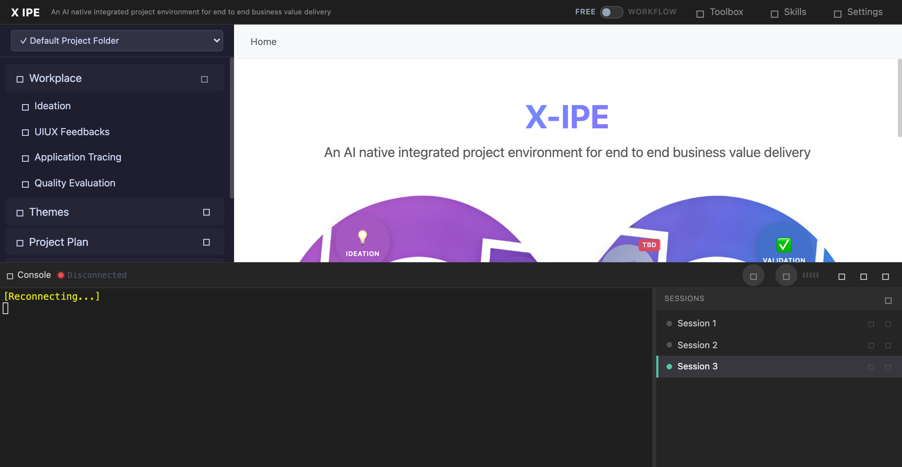

# UI/UX Feedback

**ID:** Feedback-20260310-154318
**URL:** http://127.0.0.1:5858/
**Date:** 2026-03-10 15:45:28

## Selected Elements

- `{'selector': '#copilot-cmd-btn', 'parents': ['div#page-root', 'div#terminal-panel', 'div#terminal-header', 'div.terminal-header-center']}`

## Feedback

this copilot button should also base on the cli choosed (copilot, opencode, claude-code), and for copilot cli it's not only all resources, but also all paths ' --allow-all-paths'

## Screenshot

