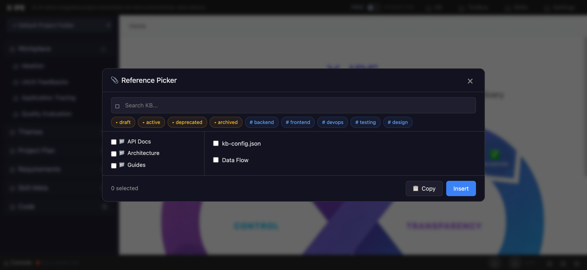

# UI/UX Feedback

**ID:** Feedback-20260313-102717
**URL:** http://127.0.0.1:5858/
**Date:** 2026-03-13 10:35:10

## Selected Elements

- `{'selector': 'label.kb-ref-tree-item', 'parents': ['div.kb-ref-modal', 'div.kb-ref-body', 'div.kb-ref-tree-panel', 'div.kb-ref-tree-folder']}`

## Feedback

let's do this for the folder part, 1. it's no longer selectable, instead the right part should show the sub-file and files within the selected folder. 2. the folder part should show the knowledge base root, and other folder under it or within it's sub-folder should show like a tree (you can reference ideation tree view, but only show folders) 3. no dark theme. 4. the modal size should be standard size both hight and width. 5. content should be scrollable if needed. 6. two types of tags should be in two different lines. 7. in the right part on it's top should show the ‘
Navigation bar’ and on most right, we should have a check box, so we allow the current folder to be selected (replace the check box on folder part). 8. the copied or referenced link should be full pass 'x-ipe-docs/knowledge-base/xxxx'

## Screenshot

